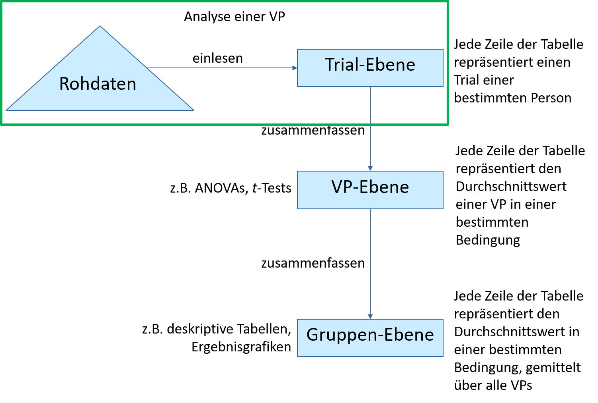

\
\
<div style="text-align: right"> <a href="https://github.com/Akramerhh/EEP1/blob/master/Skripte/index.rmd"></a> </div>                                                

# 1. Vorbereitung Datenanalyse                    

\


\
\

**Ziel** 

1. Überlegen Sie anhand Ihrer Hypothesen, welche Ergebnisse Sie für Ihr Experiment erwarten.\ 
2. Entwerfen Sie eine Ergebnisgrafik und speichern sie diese digital (Foto, Paint o.ä.). \
3. Überlegen Sie, wie Sie die Daten bearbeiten müssen. Welche Schritte sind erforderlich? 

\


\

## 0. Installation

1. R 4.1.2 installieren **(Bitte unbedingt neu installieren!)**
    * Windows: <https://cran.r-project.org/bin/windows/base/> \
    * Mac: <https://cran.r-project.org/bin/macosx/> \
2. RStudio Desktop installieren 
    * <https://www.rstudio.com/products/rstudio/download/> \


## 1. RStudio Projekte

Ausführliche Infos zu R-Projekten findet ihr hier:
<https://r4ds.had.co.nz/workflow-projects.html>


Damit ihr die Beispiele einfach auf eure Experimente übertragen könnt, empfehle ich folgende Ordnerstruktur zu erstellen, wobei ihr *Experiment Name* durch euer Experiment ersetzt:

<a name="Ordner"></a>

{width="65%"}

Danach könnt ihr im Menü über **File -> New Project** ein Project erstellen. Wählt die Option **Existing Directory**:


Und navigiert danach zu eurem **Experiment Ordner**.

Folgende Einstellungen solltet ihr vornehmen:

1. **Unter Tools -> Project Options**


2. **Unter Tools -> Global Options**


In der Regel sollte Rstudio nun direkt zu Beginn euer Projekt laden und der Workspace von **R** sollte leer sein.

### Austausch von Projekten

Der riesige Vorteil von Projekten liegt darin, dass ihr nun einfach euren Ordner *Experiment Name* zippen und z.B. über OpenOlat euren Komiliton_innen zur Verfügung stellen könnt, z.B. in euren Ordner **Gruppenarbeit** über :


Egal wo eure Komiliton_innen den Ordner speichern, das Projekt sollte genauso laufen. Das ist ideal im Sinne der **Reproduzierbarkeit**!

\

#### Zippen

Hier findet ihr ein Tutorial zur Verwendung von 7-Zip. 

<https://www.top-windows-tutorials.com/free-zip/>

Gezippte Ordner könnt Ihr, wie oben beschrieben, auf Olat hochladen für eure Komiliton_innen und ggfs. wieder entzippen. Dann wird aus dem Zip-Ordner ein Olat-Ordner erstellt:


\

### Screencasts

**Windows**
Zippen und Projekte auf Olat teilen:

<iframe src="https://player.vimeo.com/video/499989775" width="640" height="564" frameborder="0" allow="autoplay; fullscreen" allowfullscreen></iframe>

**Mac**
Ordner erstellen, Projekt erstellen, komprimieren und Projekte auf Olat teilen:

<iframe src="https://player.vimeo.com/video/650904290" width="640" height="564" frameborder="0" allow="autoplay; fullscreen" allowfullscreen></iframe>


\

## 2. R Markdown
\

### Warum R Markdown

<a name="RMarkdown"></a>


Mit Hilfe von R Markdown können wir unseren `R-Code` in einen Text eingliedern.

Damit wird es einfacher eure Auswertung zu kommentieren und Grafiken und Tabellen können z.B. direkt aus dem Dokument in euren Bericht übernommen werden.

Darüberhinaus könnt ihr euren Code in Chunks gliedern und den Output direkt unter dem jeweiligen Code-Chunk ausgeben lassen. 

Das macht es sehr einfach Zwischenergebnisse zu kontrollieren und ihr habt den Output immer dort, wo er erzeugt wird.

Zuerst müsst ihr ein R Markdown erstellen. 


Und dieses unter einem aussagekräftigem Namen speicher **File -> save as ...** in **Experiment Name/Skripte**

Zusätzlich muss eine Option angepasst werden. Mit der folgenden Einstellung sorgt ihr dafür das R-Markdown euren Projekt-Ordner als Working-Directory verwendet:


Nun können alle Pfade relativ zu eurem Projektordner angegeben werden.

\

### Text Formatierung

R Markdown bietet eine Reihe von Möglichkeiten eure Dokumente zu formatieren. So könnt ihr Text *kursiv* schreiben indem ihr ihn mit Sternen (\*kursiv\*) oder Unterstrichen umschließt (\_kursiv\_). 

Zwei Sterne (\*\*fett\*\*) oder Unterstriche (\_\_fett\_\_) erzeugen **fetten** Text. 

Einzelne Zeilenumbrüche im Markdown werden nicht in den Output übernommen. Dafür muss am Ende der Zeile ein \\ hinzugefügt werden. 

Hier \
sollte ein Zeilenumbruch sein. Hier 
nicht.

Diverse Zeichen haben in R-Markdown eine besondere Bedeutung wie z.B. __\*__ und **\_**. 

Wenn ihr diese im Output-Dokument darstellen wollt müsst ihr ein **\\** davor setzen (das gilt auch für den Backslash selbst, also muss **\\\\** verwendet werden). 

Ganze Abschnitte in denen ihr mehrere Sonderzeichen verwendet, könnt ihr mit ```` `...` ```` umschließen und damit gleichzeitig hervorheben.

\

### Überschriften

<a name="headings"></a>

Durch ein bzw. mehrere **\#** könnt Überschriften erzeugen. Die Anzahl der **\#** bestimmt das Level in der Überschriftenhierarchie:

\#\#\#  Level 4

\#\#\#\#  Level 5

\#\#\#\#\#  Level 6

#### Level 4 {.unlisted .unnumbered}
##### Level 5 {.unlisted .unnumbered}
###### Level 6 {.unlisted .unnumbered}


Anhand der Überschriften wird sowohl im Editor, als auch im späteren Dokument (dafür müsst ihr im Header die Option `toc: yes` hinzufügen unter `output:  html_document:`) ein Inhaltsverzeichnis angelegt.  


### Verlinkung

<a name="links"></a>

<style>
div.red { background-color:#ffb8b8; border-radius: 5px; padding: 20px;}
</style>

<style>
div.green { background-color:#b8ffb8; border-radius: 5px; padding: 20px;}
</style>

<style>
div.blue { background-color:#e6f0ff; border-radius: 5px; padding: 20px;}
</style>

<div class = "green">

**FANCY**

Ihr könnt im Output-Dokument auf Websites verlinken mit der folgenden Syntax `[verlinkter Text](http://example.com)` 

Lokale Links z.B. zu Ordnern sind nicht möglich. 

Wenn das Output-Format **html** ist, ist es benutzerfreundlicher, wenn ihr die Webseite in einem neuen Fenster öffnet. 

Dazu nutzen wir den html Tag `<a href="http://example.com" target="_blank">verlinkter Text</a>`.

Hier ist ein Link zu <a href="https://www.openolat.uni-hamburg.de/auth/RepositoryEntry/121701530/CourseNode/102475010134417" target="_blank">OpenOlat</a> 

In html haben wir zusätzlich die Möglichkeit, *innerhalb eines Dokuments* zu verlinken. Am einfachsten ist es, auf eine Überschrift zu verlinken. Dazu nutzen wir einfach eckige Klammern, in die wir den Namen einer Überschrift schreiben: [R Markdown] `([R Markdown])`.

Ähnlich zu Links könnt ihr Bilder einfügen:
``, z.B. einen Screenshot aus den Kurs-Folien: \

{width="100%"}

**Benutzt dazu unbedingt den Header aus diesem Skript, ansonsten müsst ihr die Bilder in den Skript-Ordner packen.**
\
</div>

\

### Output Dokument erzeugen

#### Header

<a name="HTMLHeader"></a>

Im Header können diverse Argumente angegeben werden, die bestimmen, wie euer Output-Dokument gerendert wird (d.h. wie das Output-Dokument am Ende aussieht). Hier findet ihr eine kurze Einleitung:

<https://zsmith27.github.io/rmarkdown_crash-course/lesson-4-yaml-headers.html> 

Im Header könnt ihr Output-Formate angeben. Ich empfehle euch für den Start bei HTML zu bleiben. Dafür könnt ihr folgenden Header verwenden:

````
---
title: "Untitled"
author: ""
date: ""
knit: (function(inputFile, encoding) {
    rmarkdown::render(inputFile, encoding = encoding, output_dir = "./")
  })
output: 
  html_document:
    numbered: yes
    df_print: paged
    toc: yes
    toc_float: true
    self_contained: false
editor_options: 
  chunk_output_type: inline
---

````

Die Zeile `knit: (function(inputFile, encoding) {rmarkdown::render(inputFile, encoding = encoding, output_dir = "./")}` sorgt dafür, dass auch Bildpfade relativ zum Projektordner angegeben werden können. Eure Output-Dateien werden dann auch im Projektordner gespeichert.fgraph


Um nun ein Output-Dokument zu erzeugen gibt es zwei Möglichkeiten:

* über die Tastenkombination `Strg + Shift + K` bzw. :


* über das Menü:


\


### R Code

#### Chunks

In R-Markdown wird der Code durch Chunks gegliedert, in diesen könnt ihr *R* ganz normal verwenden, wie ihr es von Skripten gewohnt seid. Es gibt drei Möglichkeiten Chunks einzufügen:

* Das Tastenkürzel `Strg + Alt + I` fügt einen Chunk ein

* Alles was ihr mit ```` ```{r}...``` ```` einschließt wird als R-Code interpretiert

* Im Menü fügt  **Insert** -> **R** einen Chunk ein \


Um einen Chunk auszuführen gibt es zwei Möglichkeiten
* Das Tastenkürzel `Strg + Shift + Enter` führt den Chunk aus
* Ihr klickt auf den grünen Pfeil rechts oben


\

<div class = "green">

**FANCY**

Für jeden Chunk lassen sich diverse Optionen im Header (`{r}`)ändern, hier eine Liste wichtiger Optionen:

* `{r, results = 'hide'}` Ergebnisse des Chunks werden nicht im Output-Dokument eingefügt
* `{r, message=FALSE}` Nachrichte beim Ausführen des Chunks werden nicht im Output-Dokument eingefügt
* `{r, warning=FALSE}` Warnungen beim Ausführen des Chunks werden nicht im Output-Dokument eingefügt
* `{r, error=FALSE}` Fehler beim Ausführen des Chunks werden nicht im Output-Dokument eingefügt
* `{r, eval=FALSE}` Chunk wird nicht ausgeführt beim kompilieren
* `{r, echo=FALSE}` Chunk wird nicht eingefügt im Output-Dokument
* `{r, include=FALSE}` Chunk wird ausgeführt beim kompilieren aber nicht eingefügt ins Output-Dokument

</div>

\

#### Inline Code

Um R-Code im Text zu verwenden könnt ihr ```` `r...` ```` verwenden . Und so z.B.\
einen Vector definieren  (````  ````) und den Mittelwert ausgeben 2.3333333 (````  ````). Im Text ist dann nur das Ergebnis von ````  ```` zu sehen, im gleichen Format wie der umgebende Text.

Zudem könnt ihr Text hervorheben, wenn ihr ihn mit ```` `...` ```` umschließt.


\
\

## **Aufgaben**

1. Erstellt die [Ordnerstuktur](#Ordner) \
2. Erstellt ein R-Markdown [HTML](#RMarkdown) \
    * Datei erstellen
    * [Header](#HTMLHeader) anpassen (AutorInnen usw.)
    * Erstellt durch [Überschriften](#headings) eine Struktur, die die notwendigen Arbeitsschritte abbildet \
        - Erster Abschnitt enthält Kurzbeschreibung und Entwurf der Ergebnisgrafik ([link](#links) einfügen)
        - Zweiter heißt `R Setup` und enthält einen leeren Code-Chunk

<a href="https://ep.mafiasi.de/p/EEP_K_Session_Feedback" target="_blank">Feeback zur Session</a> Seminar K

<a href="https://ep.mafiasi.de/p/EEP_E_Session_Feedback" target="_blank">Feeback zur Session</a> Seminar E


## 3 R Setup
\

Damit unser Projekt vernünftig läuft. Müsst ihr ganz am Anfang folgenden Chunk einfügen:


```r
library(knitr)
opts_knit$set(
               root.dir = rprojroot::find_rstudio_root_file(),
               base.dir = rprojroot::find_rstudio_root_file()
              )
```

Dieser sorgt dafür, dass eure `Rmarkdown`-Dokumente im Projektordner ausgeführt werden und alle Pfade vernünftig funktionieren.


Zu Beginn des Skripts müssen Pakete einmalig installiert werden über eine der folgenden Möglichkeiten:

* `install.packages("Name  des  Pakets")`
* Menü -> Tools -> Install Packages...

In jeder Session müssen Pakete über `library(Name  des  Pakets)` geladen werden. Der folgende Chunk installiert und lädt ggplot2 


```r
install.packages("ggplot2")
library(ggplot2)
```

Wenn das Paket bereits installiert ist, kann es dabei zu Fehlermeldungen kommen.In folgendem Chunk: \

* schreiben wir alle Pakete, die wir benötigen in einen Vector
* kontrollieren ob alle Pakete installiert sind
  * `if (length(setdiff(packages, rownames(installed.packages()))) > 0) {...}`
* wenn Pakete fehlen, identifizieren wir sie
  * `rownames(installed.packages())` liefert alle installierten Pakete
  * `setdiff(packages, rownames(installed.packages()))` gibt uns alle Elemente aus **packages** die nicht installiert sind

* und installieren  nur Pakete die fehlen
  *install.packages(setdiff(packages, rownames(installed.packages())))
* schließlich werden alle Pakete geladen
  * dies ginge auch über `lapply(packages, require, character.only = TRUE)` 
* kommen neue Pakete hinzu \
  müssen diese dann lediglich in packages eingetragen werden


```r
#lapply(paste('package:',names(sessionInfo()$otherPkgs),sep = ""),detach,character.only = TRUE, unload = TRUE)

packages <- c("knitr",
              "shiny",
              "Rmisc",
              "tidyverse",
              "ez",
              "rmdformats",
              "rmarkdown",
              "ggsci",
              "viridis",
              "lemon",
              "posterdown",
              "apaTables"
              )
           

if (length(setdiff(packages, rownames(installed.packages()))) > 0) {
  install.packages(setdiff(packages, rownames(installed.packages())))  
}


# Die Reihenfolge ist hier wichtig, Rmisc muss vor dplyr/tidiverse geladen werden
library("tidyverse")
library("ez")
```

**Wichtig**: Damit euer Projekt ohne Probleme auf anderen Computern läuft, solltet ihr diesen Code-Chunk verwenden, denn wenn auf dem Computer Pakete fehlen, werden sie direkt installiert. Andernfalls würde es zu Fehlermeldungen kommen.


<div class = "green">

**FANCY**


```r
# Alternativ könnt ihr statt:

# library("Rmisc")
# library("tidyverse")
# library("ez")
# ...

# folgenden Befehl verwenden, der alle Pakete in packages mit einem Mal liest:

lapply(packages, require, character.only = TRUE)
```
</div>


Nützliche Infos zum Management von Paketen findet ihr unter dem folgenden <a href="http://methods-berlin.com/wp-content/uploads/Pakete.html" target="_blank">Link</a>

Packages werden ständig aktualisiert. Um die Replizierbarkeit einer Auswertung zu gewährleisten muss daher festgehalten werden, welche Paketversionen verwendet werden. 

Die Funktion `sessionInfo()` liefert genau diese Informationen.Idealerweise speichert ihr den Output in einer Textdatei z.B. mit der Funktion `writeLines()`. 

Die Funktion `capture.output()` wandelt den Output von `sessionInfo()` in einen exportierbaren String um. 
Wir nutzen `paste0(format(Sys.time(), "%Y%b%d"),"sessionInfo.txt")` um das Datum (`Sys.time()`) zu formatieren (`format()`) und zum Namen der Textdatei hinzuzufügen (`paste0()`). 

Damit vermeidet ihr, das die Datei versehentlich überschrieben wird, wenn ihr das Skript zu einen späteren Zeitpunkt nochmal laufen lasst. 

Es gibt diverse Möglichkeiten das Datum zu formatieren: (siehe z.B. <a href="http://applied-r.com/r-dates-and-times/" target="_blank">hier</a>)


```r
sessionInfo()
```

```
R version 4.1.2 (2021-11-01)
Platform: x86_64-w64-mingw32/x64 (64-bit)
Running under: Windows 10 x64 (build 22000)

Matrix products: default

locale:
[1] LC_COLLATE=German_Germany.1252  LC_CTYPE=German_Germany.1252   
[3] LC_MONETARY=German_Germany.1252 LC_NUMERIC=C                   
[5] LC_TIME=German_Germany.1252    

attached base packages:
[1] stats     graphics  grDevices utils     datasets  methods   base     

other attached packages:
 [1] ez_4.4-0         forcats_0.5.1    stringr_1.4.0    dplyr_1.0.7     
 [5] purrr_0.3.4      readr_2.1.0      tidyr_1.1.4      tibble_3.1.6    
 [9] ggplot2_3.3.5    tidyverse_1.3.1  rmarkdown_2.11   rmdformats_1.0.3
[13] knitr_1.36      

loaded via a namespace (and not attached):
 [1] httr_1.4.2       sass_0.4.0       jsonlite_1.7.2   splines_4.1.2   
 [5] carData_3.0-4    modelr_0.1.8     bslib_0.3.1      assertthat_0.2.1
 [9] cellranger_1.1.0 yaml_2.2.1       pillar_1.6.4     backports_1.4.0 
[13] lattice_0.20-45  glue_1.5.0       digest_0.6.28    rvest_1.0.2     
[17] minqa_1.2.4      colorspace_2.0-2 htmltools_0.5.2  Matrix_1.3-4    
[21] plyr_1.8.6       pkgconfig_2.0.3  broom_0.7.10     haven_2.4.3     
[25] bookdown_0.24    scales_1.1.1     tzdb_0.2.0       lme4_1.1-27.1   
[29] mgcv_1.8-38      generics_0.1.1   car_3.0-12       ellipsis_0.3.2  
[33] withr_2.4.2      cli_3.1.0        magrittr_2.0.1   crayon_1.4.2    
[37] readxl_1.3.1     evaluate_0.14    fs_1.5.0         fansi_0.5.0     
[41] nlme_3.1-153     MASS_7.3-54      xml2_1.3.2       tools_4.1.2     
[45] hms_1.1.1        lifecycle_1.0.1  munsell_0.5.0    reprex_2.0.1    
[49] compiler_4.1.2   jquerylib_0.1.4  rlang_0.4.12     grid_4.1.2      
[53] nloptr_1.2.2.3   rstudioapi_0.13  boot_1.3-28      gtable_0.3.0    
[57] abind_1.4-5      DBI_1.1.1        reshape2_1.4.4   R6_2.5.1        
[61] lubridate_1.8.0  fastmap_1.1.0    utf8_1.2.2       rprojroot_2.0.2 
[65] stringi_1.7.5    Rcpp_1.0.7       vctrs_0.3.8      dbplyr_2.1.1    
[69] tidyselect_1.1.1 xfun_0.28       
```

```r
writeLines(capture.output(sessionInfo()), paste0(format(Sys.time(), "%Y%b%d"),"sessionInfo.txt"))
```
\

### Verkettete Befehle verstehen

<iframe src="https://player.vimeo.com/video/499994961" width="640" height="564" frameborder="0" allow="autoplay; fullscreen" allowfullscreen></iframe>

\

### Projekt-Settings checken

Wenn ihr euer RStudio-Projekt wie oben beschrieben konfiguriert habt, solltet ihr jedes Mal wenn das Projekt geöffnet wird im richtigen Working-Directory sein. 

Ihr könnt dies kontrollieren mit `getwd()`\
und ggf. korrigieren mit `setwd("C:/richtiger/Pfad/")`. 

Hierbei müsst ihr den absoluten Pfad angeben. \

**Korrigiert lieber die Einstellungen des Projekts und von R-Markdown**


```r
wd = getwd()
print(wd)
```

```
[1] "C:/Users/Alexander Kramer/Documents/PHD/Lehre/EEP1_Datenauswertung/EEP1"
```

```r
setwd(wd)
```
Der Workspace sollte ebenfalls leer sein. Ihr könnt dies kontrollieren mit `ls()`. \
Wenn der Output von `ls()` leer ist, ist es auch der Workspace. 

Andernfalls könnt ihr mit `rm(list=ls())` den Workspace leeren.


```r
ls()
```

```
[1] "edit_btn"     "encoding"     "gh_edit_path" "inputFile"    "packages"    
[6] "url"          "vec"          "wd"          
```

```r
rm(list=ls())
ls()
```

```
character(0)
```
\

# 2. Eine Beispiel-Studie


\

Den Original Text zur findet ihr <a href="https://doi.apa.org/doiLanding?doi=10.1037%2F0022-3514.80.3.381" target="_blank">hier</a> 

\


Die Studie hat einen ähnlichen Aufbau wie die meisten eurer Experimente. Abhängige Variablen sind Reaktionszeit und Antwortgenauigkeit. Allerdings gibt es drei unabhängige Variablen, die Art der Distraktoren (`DisktraktorTyp`), Expositionszeit (`Expositionszeit`) sowie der Target-Typ (`TargetTyp`). Der Einfachheit halber beschränken wir uns auf die Auswertung für emotionale Distraktoren. Die Aufgabe bestand darin anzugeben, ob sich in einer Menge von Gesichtern ein Zielreiz befand (Gesicht mit unterschiedlichem Ausdruck) oder nicht.


**Empirische Hypothesen** \

Bedrohliche Gesichter werden in einer Menge emotionaler Distraktoren schneller gefunden.

\

Die folgenden Stimuli wurden verwendet:


\

**Ergebnisse**


Eine gute Übung ist es, die Ergebnisse der Studie in den Kleingruppen verbal zu beschreiben!

Passen die Ergebnisse zu den Hypothesen?


# 3. Analyse einer VP
\

<!--  -->
\


```{=html}
<div id="htmlwidget-341be52cee089a99d300" style="width:100%;height:100%;" class="grViz html-widget"></div>
<script type="application/json" data-for="htmlwidget-341be52cee089a99d300">{"x":{"diagram":"\ndigraph dot {\n\ngraph [layout = dot,\n       rankdir = LR,\n       newrank=true,\n       compound=true,\n       label=\"Workflow\\n Dokumentation, Kommunikation, Reproduzierbarkeit\\n\",\n       labelloc  =  t, // t: Place the graph\"s title on top.\n        fontsize  = 25]\n\nnode [shape = rect,\n      style = filled,\n      color = black]\n\nedge [color=black]\n\nnode [fillcolor = red]\nImport Bereingiung \nErgebnispräsentation [label= \"Ergebnispräsentation \\n(z.B. Grafiken, Tabellen usw)\"]\n\nnode [fillcolor = white]\nZusammenfassen[label= \"Zusammenfasse (=Aggregieren)\n der Daten innerhalb der VP\"] \nDeskriptive [label= \"Deskriptive Statistik\n für die Stichprobe berechnen\"] \nInferenzstatistik \n\nsubgraph cluster_0 {\n    rankdir=TB;\n    rank=same;\n\t\tstyle=filled;\n\t\tcolor=red;\n\t\tnode [style=filled,color=white,fillcolor = white ];\n\t\tZusammenfassen -> Deskriptive -> Inferenzstatistik [constraint=false];\n\t\tlabel = \"Analyse\";\n\t\tfontsize  = 20;\n\t} \n\nImport -> Bereingiung\nBereingiung -> Deskriptive [lhead=cluster_0] ;\nDeskriptive-> Ergebnispräsentation [ltail=cluster_0];\nZusammenfassen [fillcolor= green]\nImport [fillcolor= green]\nBereingiung [fillcolor= green]\n\n}","config":{"engine":"dot","options":null}},"evals":[],"jsHooks":[]}</script>
```


**Bereinigung:**

* Vollständigkeit der Daten
* Fehler 
* Extreme Reaktionszeiten
* Auffällige Versuchspersonen


### Skript/Markdown schreiben

In ein R-Skript/ gehören alle Befehle, die die Analyse reproduzierbar machen. Das Skript sollte so geschrieben sein, dass es für jeden beliebigen Datensatz anwendbar ist. Wenn es z.B. im aktuellen Datensatz keine Reaktionszeiten schneller als 200 ms gibt, dann sollten die Befehle zum Ausschließen von Trials mit kürzeren Reaktionszeiten trotzdem im Skript enthalten sein.


<a name="Import"></a>

### Daten Import

Das Cheat-Sheet zum Daten Import findet ihr hier:
<https://raw.githubusercontent.com/rstudio/cheatsheets/master/data-import.pdf>


1. Wir legen zunächst eine Liste aller logfiles an `list.files(pattern = ".csv")`
    * **pattern** definiert eine Zeichenkette die im Namen enthalten sein muss
    * Wir wollen also nur CSV-Files
2. Dann importieren wir einen Datensatz aus dieser Liste
    * `data.example <- data.files[1]`


```r
data.files <- list.files("Alle Daten/")
data.example <- data.files[1]
daten <- read.csv(paste0("./Alle Daten/", data.example ), header=TRUE, fileEncoding = "UTF-8-BOM")
```

\

### Datenbearbeitung mit dplyr

Dplyr bietet umfangreiche Funktionen zur Bearbeitung von Datensätzen, eine Übersicht über die wichtigsten Features findet ihr im <a href="https://raw.githubusercontent.com/rstudio/cheatsheets/master/data-transformation.pdf" target="_blank">dplyr Cheatsheet</a>.

Meiner Meinung nach ist es das derzeit beste Tool zur DatenBereinigung und Aggregation in R.

Einer der Gründe dafür ist die Verwendung von <a href="https://seananderson.ca/2014/09/13/dplyr-intro/" target="_blank">Pipes</a>

<a name="tidy"></a>
\

#### Tidy-Data 

Dplyr, ggplot und ez funktionieren ideal mit Tidy Data. Drei Kriterien definieren Tidy Data:

1. Jede Variable steht in einer Spalte

2. Jede Beobachtung steht in einer Zeile

3. Jeder Wert steht in einer Zelle der Datentabelle 


Was sind die Vorteile?

1. Wenn die Daten immer nach dem gleichen Schema strukturiert werden, ist es deutlich einfacher, neue Funktionen und Tools zu erlernen die auf diesem Schema basieren. Die Syntax und Logik ist dann häufig sehr ähnlich bis gleich.

2. `R` ist im Kern vektorbasiert, das heißt grob `R` ist am schnellsten wenn Operationen nicht auf einzelne Werte angewendet werden sondern Vektoren.

Eine ausführliche Erläuterung findet ihr <a href="https://r4ds.had.co.nz/tidy-data.html" target="_blank">hier</a>.

#### Ebenen der Datenanalyse



\

#### wichtige Funktionen

* `filter(A==B)` wählt Zeilen anhand logischer Bedingungen aus (es werden Werte aus Spalte A mit Spalte B verglichen)
  *`!=` ungleich
  *`< ` kleiner
  *`<=` kleiner gleich
  *`> ` gößer
  *`=>` gröer gleich
* `select(A, B, C)` wählt Spalten A,B,C aus
* `rename(A=B)` Benennt Spalte A in B um
* `recode(sex, w = "weiblich", m = "männlich")` rekodiert Faktoren
* `mutate(C = A + B)` berechnet neue Spalten (C) aus bestehenden (A + B)
* `group_by(A,B)` gruppiert Datensatz nach Spalten (A,B), Summary-Funktionen werden für alle Gruppen die sich aus den Ausprägungen der Spalten ergeben separat angewendet
* `summarise(rt.mean = mean(rt))` aggregiert Spalten mit unterschiedlichen Funktionen  


```r
daten<- daten %>% 
  rename("Expositionszeit"= Condition1,
                 "TargetTyp"= Condition2) %>%
  mutate(Expositionszeit= as.factor(recode(Expositionszeit, "-1"= "1", "1"="2")),
         TargetTyp= recode(TargetTyp, "-1"= "friendly", "1"="threating"))

daten1 = filter(daten, rt>200)
daten2 = filter(daten, Expositionszeit == "A")
daten3 = select(daten, Expositionszeit, TargetTyp ,  corr)
```


<div class = "red">

**WICHTIG**: Im Allgemeinen muss bei allen Funktionen als erstes Argument der Datensatz angegeben werden. Später verwenden wir [Pipes](#Pipes), dann ist dies nicht mehr nötig. Alle obigen Funktionen folgen der gleichen Struktur:

* Das erste Argument ist ein Datensatz
* die folgenden Argumente beschreiben, was mit dem Datensatz passieren soll
* Das Ergebnis ist wieder ein Datensatz

</div>


#### Pipes {#Pipes}

Pipes **`%>%`** nehmen den Output eines Ausdrucks (meist eine Funktion) und verwenden ihn als Argument für die nächste Funktion. 

Damit lassen sich mehrere Funktionen miteinander verknüpfen. 

In unserem Fall ist der Output jeder Funktion der veränderte Datensatz, der weitergereicht wird an die nächste Funktion.

Die Logik ist immer gleich. Als erstes übergeben wir einen Datensatz `daten` und dann führen wir mit dem Datensatz einen Befehl nach dem anderen aus. 


```r
daten %>% 
  filter(rt>200) %>% 
  group_by(Expositionszeit) %>% 	
  dplyr::summarise(sum.err = sum(corr),
            mean.rt	= mean(rt),
            sd.rt 	= sd(rt),
            n 	= dplyr::n())
```

<div data-pagedtable="false">
  <script data-pagedtable-source type="application/json">
{"columns":[{"label":["Expositionszeit"],"name":[1],"type":["fct"],"align":["left"]},{"label":["sum.err"],"name":[2],"type":["int"],"align":["right"]},{"label":["mean.rt"],"name":[3],"type":["dbl"],"align":["right"]},{"label":["sd.rt"],"name":[4],"type":["dbl"],"align":["right"]},{"label":["n"],"name":[5],"type":["int"],"align":["right"]}],"data":[{"1":"1","2":"94","3":"1152.548","4":"185.6708","5":"120"},{"1":"2","2":"97","3":"1189.778","4":"211.7875","5":"120"}],"options":{"columns":{"min":{},"max":[10]},"rows":{"min":[10],"max":[10]},"pages":{}}}
  </script>
</div>

<a name="aggregieren"></a>

#### Spalten erstellen und aggregieren


Mit `mutate()` könnt ihr neue Spalten erzeugen. Dies ist z.B. hilfreich wenn ihr aus mehreren Spalten eine neue Spalte berechnen oder einzelne Trials mit dem Mittelwert vergleichen wollt. In folgendem Beispiel erstellen wir zwei Spalten:
* eine die die Reaktionszeit in Sekunden enthält
* eine die den Mittelwert der VPs enthält für die Reaktionszeit.


```r
daten %>% mutate(rt.sekunden = rt/1000,
                 rt.mean = mean(rt))
```

<div data-pagedtable="false">
  <script data-pagedtable-source type="application/json">
{"columns":[{"label":["X"],"name":[1],"type":["int"],"align":["right"]},{"label":["Expositionszeit"],"name":[2],"type":["fct"],"align":["left"]},{"label":["TargetTyp"],"name":[3],"type":["chr"],"align":["left"]},{"label":["id"],"name":[4],"type":["chr"],"align":["left"]},{"label":["rt"],"name":[5],"type":["dbl"],"align":["right"]},{"label":["p"],"name":[6],"type":["dbl"],"align":["right"]},{"label":["corr"],"name":[7],"type":["int"],"align":["right"]},{"label":["vpnr"],"name":[8],"type":["int"],"align":["right"]},{"label":["phase"],"name":[9],"type":["chr"],"align":["left"]},{"label":["age"],"name":[10],"type":["int"],"align":["right"]},{"label":["gender"],"name":[11],"type":["chr"],"align":["left"]},{"label":["hand"],"name":[12],"type":["chr"],"align":["left"]},{"label":["rt.sekunden"],"name":[13],"type":["dbl"],"align":["right"]},{"label":["rt.mean"],"name":[14],"type":["dbl"],"align":["right"]}],"data":[{"1":"1","2":"1","3":"friendly","4":"K1","5":"1131.5631","6":"0.7","7":"0","8":"1","9":"uebung","10":"40","11":"w","12":"r","13":"1.1315631","14":"1171.163"},{"1":"2","2":"1","3":"friendly","4":"K1","5":"1442.0088","6":"0.7","7":"1","8":"1","9":"uebung","10":"40","11":"w","12":"r","13":"1.4420088","14":"1171.163"},{"1":"3","2":"1","3":"friendly","4":"K1","5":"966.4807","6":"0.7","7":"1","8":"1","9":"uebung","10":"40","11":"w","12":"r","13":"0.9664807","14":"1171.163"},{"1":"4","2":"1","3":"friendly","4":"K1","5":"1421.6852","6":"0.7","7":"1","8":"1","9":"uebung","10":"40","11":"w","12":"r","13":"1.4216852","14":"1171.163"},{"1":"5","2":"1","3":"friendly","4":"K1","5":"1543.2703","6":"0.7","7":"1","8":"1","9":"uebung","10":"40","11":"w","12":"r","13":"1.5432703","14":"1171.163"},{"1":"6","2":"1","3":"friendly","4":"K1","5":"1179.6604","6":"0.7","7":"1","8":"1","9":"uebung","10":"40","11":"w","12":"r","13":"1.1796604","14":"1171.163"},{"1":"7","2":"1","3":"friendly","4":"K1","5":"1161.2574","6":"0.7","7":"1","8":"1","9":"experiment","10":"40","11":"w","12":"r","13":"1.1612574","14":"1171.163"},{"1":"8","2":"1","3":"friendly","4":"K1","5":"874.4570","6":"0.7","7":"0","8":"1","9":"experiment","10":"40","11":"w","12":"r","13":"0.8744570","14":"1171.163"},{"1":"9","2":"1","3":"friendly","4":"K1","5":"968.5896","6":"0.7","7":"0","8":"1","9":"experiment","10":"40","11":"w","12":"r","13":"0.9685896","14":"1171.163"},{"1":"10","2":"1","3":"friendly","4":"K1","5":"953.6960","6":"0.7","7":"0","8":"1","9":"experiment","10":"40","11":"w","12":"r","13":"0.9536960","14":"1171.163"},{"1":"11","2":"1","3":"friendly","4":"K1","5":"1196.0816","6":"0.7","7":"1","8":"1","9":"experiment","10":"40","11":"w","12":"r","13":"1.1960816","14":"1171.163"},{"1":"12","2":"1","3":"friendly","4":"K1","5":"1046.9369","6":"0.7","7":"1","8":"1","9":"experiment","10":"40","11":"w","12":"r","13":"1.0469369","14":"1171.163"},{"1":"13","2":"1","3":"friendly","4":"K1","5":"1258.0639","6":"0.7","7":"1","8":"1","9":"experiment","10":"40","11":"w","12":"r","13":"1.2580639","14":"1171.163"},{"1":"14","2":"1","3":"friendly","4":"K1","5":"1096.0048","6":"0.7","7":"1","8":"1","9":"experiment","10":"40","11":"w","12":"r","13":"1.0960048","14":"1171.163"},{"1":"15","2":"1","3":"friendly","4":"K1","5":"1216.9232","6":"0.7","7":"1","8":"1","9":"experiment","10":"40","11":"w","12":"r","13":"1.2169232","14":"1171.163"},{"1":"16","2":"1","3":"friendly","4":"K1","5":"1927.6921","6":"0.7","7":"1","8":"1","9":"experiment","10":"40","11":"w","12":"r","13":"1.9276921","14":"1171.163"},{"1":"17","2":"1","3":"friendly","4":"K1","5":"1045.2237","6":"0.7","7":"1","8":"1","9":"experiment","10":"40","11":"w","12":"r","13":"1.0452237","14":"1171.163"},{"1":"18","2":"1","3":"friendly","4":"K1","5":"1264.8020","6":"0.7","7":"0","8":"1","9":"experiment","10":"40","11":"w","12":"r","13":"1.2648020","14":"1171.163"},{"1":"19","2":"1","3":"friendly","4":"K1","5":"1510.1319","6":"0.7","7":"1","8":"1","9":"experiment","10":"40","11":"w","12":"r","13":"1.5101319","14":"1171.163"},{"1":"20","2":"1","3":"friendly","4":"K1","5":"971.5866","6":"0.7","7":"1","8":"1","9":"experiment","10":"40","11":"w","12":"r","13":"0.9715866","14":"1171.163"},{"1":"21","2":"1","3":"friendly","4":"K1","5":"1174.2129","6":"0.7","7":"1","8":"1","9":"experiment","10":"40","11":"w","12":"r","13":"1.1742129","14":"1171.163"},{"1":"22","2":"1","3":"friendly","4":"K1","5":"924.4310","6":"0.7","7":"0","8":"1","9":"experiment","10":"40","11":"w","12":"r","13":"0.9244310","14":"1171.163"},{"1":"23","2":"1","3":"friendly","4":"K1","5":"996.9892","6":"0.7","7":"0","8":"1","9":"experiment","10":"40","11":"w","12":"r","13":"0.9969892","14":"1171.163"},{"1":"24","2":"1","3":"friendly","4":"K1","5":"1047.7837","6":"0.7","7":"1","8":"1","9":"experiment","10":"40","11":"w","12":"r","13":"1.0477837","14":"1171.163"},{"1":"25","2":"1","3":"friendly","4":"K1","5":"793.4472","6":"0.7","7":"1","8":"1","9":"experiment","10":"40","11":"w","12":"r","13":"0.7934472","14":"1171.163"},{"1":"26","2":"1","3":"friendly","4":"K1","5":"1046.2143","6":"0.7","7":"0","8":"1","9":"experiment","10":"40","11":"w","12":"r","13":"1.0462143","14":"1171.163"},{"1":"27","2":"1","3":"friendly","4":"K1","5":"1371.9310","6":"0.7","7":"1","8":"1","9":"experiment","10":"40","11":"w","12":"r","13":"1.3719310","14":"1171.163"},{"1":"28","2":"1","3":"friendly","4":"K1","5":"1028.5054","6":"0.7","7":"1","8":"1","9":"experiment","10":"40","11":"w","12":"r","13":"1.0285054","14":"1171.163"},{"1":"29","2":"1","3":"friendly","4":"K1","5":"1089.0199","6":"0.7","7":"1","8":"1","9":"experiment","10":"40","11":"w","12":"r","13":"1.0890199","14":"1171.163"},{"1":"30","2":"1","3":"friendly","4":"K1","5":"1145.2504","6":"0.7","7":"1","8":"1","9":"experiment","10":"40","11":"w","12":"r","13":"1.1452504","14":"1171.163"},{"1":"31","2":"1","3":"friendly","4":"K1","5":"1094.1346","6":"0.7","7":"1","8":"1","9":"experiment","10":"40","11":"w","12":"r","13":"1.0941346","14":"1171.163"},{"1":"32","2":"1","3":"friendly","4":"K1","5":"958.7083","6":"0.7","7":"1","8":"1","9":"experiment","10":"40","11":"w","12":"r","13":"0.9587083","14":"1171.163"},{"1":"33","2":"1","3":"friendly","4":"K1","5":"1315.6751","6":"0.7","7":"1","8":"1","9":"experiment","10":"40","11":"w","12":"r","13":"1.3156751","14":"1171.163"},{"1":"34","2":"1","3":"friendly","4":"K1","5":"1184.3405","6":"0.7","7":"1","8":"1","9":"experiment","10":"40","11":"w","12":"r","13":"1.1843405","14":"1171.163"},{"1":"35","2":"1","3":"friendly","4":"K1","5":"1280.5263","6":"0.7","7":"1","8":"1","9":"experiment","10":"40","11":"w","12":"r","13":"1.2805263","14":"1171.163"},{"1":"36","2":"1","3":"friendly","4":"K1","5":"912.7338","6":"0.7","7":"1","8":"1","9":"experiment","10":"40","11":"w","12":"r","13":"0.9127338","14":"1171.163"},{"1":"37","2":"1","3":"friendly","4":"K1","5":"1221.3260","6":"0.7","7":"1","8":"1","9":"experiment","10":"40","11":"w","12":"r","13":"1.2213260","14":"1171.163"},{"1":"38","2":"1","3":"friendly","4":"K1","5":"1058.4114","6":"0.7","7":"0","8":"1","9":"experiment","10":"40","11":"w","12":"r","13":"1.0584114","14":"1171.163"},{"1":"39","2":"1","3":"friendly","4":"K1","5":"1308.3601","6":"0.7","7":"1","8":"1","9":"experiment","10":"40","11":"w","12":"r","13":"1.3083601","14":"1171.163"},{"1":"40","2":"1","3":"friendly","4":"K1","5":"1171.5059","6":"0.7","7":"1","8":"1","9":"experiment","10":"40","11":"w","12":"r","13":"1.1715059","14":"1171.163"},{"1":"41","2":"1","3":"friendly","4":"K1","5":"1269.8071","6":"0.7","7":"0","8":"1","9":"experiment","10":"40","11":"w","12":"r","13":"1.2698071","14":"1171.163"},{"1":"42","2":"1","3":"friendly","4":"K1","5":"1121.8114","6":"0.7","7":"1","8":"1","9":"experiment","10":"40","11":"w","12":"r","13":"1.1218114","14":"1171.163"},{"1":"43","2":"1","3":"friendly","4":"K1","5":"1110.7091","6":"0.7","7":"1","8":"1","9":"experiment","10":"40","11":"w","12":"r","13":"1.1107091","14":"1171.163"},{"1":"44","2":"1","3":"friendly","4":"K1","5":"1275.8269","6":"0.7","7":"1","8":"1","9":"experiment","10":"40","11":"w","12":"r","13":"1.2758269","14":"1171.163"},{"1":"45","2":"1","3":"friendly","4":"K1","5":"819.9629","6":"0.7","7":"1","8":"1","9":"experiment","10":"40","11":"w","12":"r","13":"0.8199629","14":"1171.163"},{"1":"46","2":"1","3":"friendly","4":"K1","5":"1086.8724","6":"0.7","7":"1","8":"1","9":"experiment","10":"40","11":"w","12":"r","13":"1.0868724","14":"1171.163"},{"1":"47","2":"1","3":"friendly","4":"K1","5":"1227.7035","6":"0.7","7":"1","8":"1","9":"experiment","10":"40","11":"w","12":"r","13":"1.2277035","14":"1171.163"},{"1":"48","2":"1","3":"friendly","4":"K1","5":"1199.8219","6":"0.7","7":"1","8":"1","9":"experiment","10":"40","11":"w","12":"r","13":"1.1998219","14":"1171.163"},{"1":"49","2":"1","3":"friendly","4":"K1","5":"1087.0445","6":"0.7","7":"1","8":"1","9":"experiment","10":"40","11":"w","12":"r","13":"1.0870445","14":"1171.163"},{"1":"50","2":"1","3":"friendly","4":"K1","5":"1359.3188","6":"0.7","7":"1","8":"1","9":"experiment","10":"40","11":"w","12":"r","13":"1.3593188","14":"1171.163"},{"1":"51","2":"1","3":"friendly","4":"K1","5":"1069.8476","6":"0.7","7":"0","8":"1","9":"experiment","10":"40","11":"w","12":"r","13":"1.0698476","14":"1171.163"},{"1":"52","2":"1","3":"friendly","4":"K1","5":"986.8989","6":"0.7","7":"1","8":"1","9":"experiment","10":"40","11":"w","12":"r","13":"0.9868989","14":"1171.163"},{"1":"53","2":"1","3":"friendly","4":"K1","5":"883.0832","6":"0.7","7":"1","8":"1","9":"experiment","10":"40","11":"w","12":"r","13":"0.8830832","14":"1171.163"},{"1":"54","2":"1","3":"friendly","4":"K1","5":"906.6728","6":"0.7","7":"1","8":"1","9":"experiment","10":"40","11":"w","12":"r","13":"0.9066728","14":"1171.163"},{"1":"55","2":"1","3":"friendly","4":"K1","5":"1018.2868","6":"0.7","7":"1","8":"1","9":"experiment","10":"40","11":"w","12":"r","13":"1.0182868","14":"1171.163"},{"1":"56","2":"1","3":"friendly","4":"K1","5":"1105.5538","6":"0.7","7":"1","8":"1","9":"experiment","10":"40","11":"w","12":"r","13":"1.1055538","14":"1171.163"},{"1":"57","2":"1","3":"friendly","4":"K1","5":"1180.3909","6":"0.7","7":"1","8":"1","9":"experiment","10":"40","11":"w","12":"r","13":"1.1803909","14":"1171.163"},{"1":"58","2":"1","3":"friendly","4":"K1","5":"1056.5289","6":"0.7","7":"0","8":"1","9":"experiment","10":"40","11":"w","12":"r","13":"1.0565289","14":"1171.163"},{"1":"59","2":"1","3":"friendly","4":"K1","5":"1452.4476","6":"0.7","7":"1","8":"1","9":"experiment","10":"40","11":"w","12":"r","13":"1.4524476","14":"1171.163"},{"1":"60","2":"1","3":"friendly","4":"K1","5":"1008.5477","6":"0.7","7":"1","8":"1","9":"experiment","10":"40","11":"w","12":"r","13":"1.0085477","14":"1171.163"},{"1":"61","2":"2","3":"friendly","4":"K1","5":"1131.6132","6":"0.8","7":"1","8":"1","9":"uebung","10":"40","11":"w","12":"r","13":"1.1316132","14":"1171.163"},{"1":"62","2":"2","3":"friendly","4":"K1","5":"1077.8447","6":"0.8","7":"1","8":"1","9":"uebung","10":"40","11":"w","12":"r","13":"1.0778447","14":"1171.163"},{"1":"63","2":"2","3":"friendly","4":"K1","5":"1226.4440","6":"0.8","7":"1","8":"1","9":"uebung","10":"40","11":"w","12":"r","13":"1.2264440","14":"1171.163"},{"1":"64","2":"2","3":"friendly","4":"K1","5":"1045.5865","6":"0.8","7":"0","8":"1","9":"uebung","10":"40","11":"w","12":"r","13":"1.0455865","14":"1171.163"},{"1":"65","2":"2","3":"friendly","4":"K1","5":"1140.1584","6":"0.8","7":"1","8":"1","9":"uebung","10":"40","11":"w","12":"r","13":"1.1401584","14":"1171.163"},{"1":"66","2":"2","3":"friendly","4":"K1","5":"1307.7138","6":"0.8","7":"0","8":"1","9":"uebung","10":"40","11":"w","12":"r","13":"1.3077138","14":"1171.163"},{"1":"67","2":"2","3":"friendly","4":"K1","5":"947.5872","6":"0.8","7":"1","8":"1","9":"experiment","10":"40","11":"w","12":"r","13":"0.9475872","14":"1171.163"},{"1":"68","2":"2","3":"friendly","4":"K1","5":"1433.4700","6":"0.8","7":"1","8":"1","9":"experiment","10":"40","11":"w","12":"r","13":"1.4334700","14":"1171.163"},{"1":"69","2":"2","3":"friendly","4":"K1","5":"1080.6707","6":"0.8","7":"1","8":"1","9":"experiment","10":"40","11":"w","12":"r","13":"1.0806707","14":"1171.163"},{"1":"70","2":"2","3":"friendly","4":"K1","5":"1382.8783","6":"0.8","7":"1","8":"1","9":"experiment","10":"40","11":"w","12":"r","13":"1.3828783","14":"1171.163"},{"1":"71","2":"2","3":"friendly","4":"K1","5":"1083.8845","6":"0.8","7":"0","8":"1","9":"experiment","10":"40","11":"w","12":"r","13":"1.0838845","14":"1171.163"},{"1":"72","2":"2","3":"friendly","4":"K1","5":"1078.4293","6":"0.8","7":"1","8":"1","9":"experiment","10":"40","11":"w","12":"r","13":"1.0784293","14":"1171.163"},{"1":"73","2":"2","3":"friendly","4":"K1","5":"1139.1889","6":"0.8","7":"1","8":"1","9":"experiment","10":"40","11":"w","12":"r","13":"1.1391889","14":"1171.163"},{"1":"74","2":"2","3":"friendly","4":"K1","5":"1462.5601","6":"0.8","7":"1","8":"1","9":"experiment","10":"40","11":"w","12":"r","13":"1.4625601","14":"1171.163"},{"1":"75","2":"2","3":"friendly","4":"K1","5":"1416.5859","6":"0.8","7":"1","8":"1","9":"experiment","10":"40","11":"w","12":"r","13":"1.4165859","14":"1171.163"}],"options":{"columns":{"min":{},"max":[10]},"rows":{"min":[10],"max":[10]},"pages":{}}}
  </script>
</div>

`mean(rt)` nimmt alle Werte in `rt` und berechnet den Mittelwert. `mutate()` erkennt, dass nur ein Wert zurückgegeben wird und fügt diesen automatisch für jede Zeile zu. `rt/1000` gibt hingegen genauso viele Werte wie in `rt`stehen zurück. Also wird für jede Zeile ein unterschiedlicher Wert zugefügt. `mutate()` akzeptiert alle Funktionen die einen **Vektor** als Argument nehmen und entweder einen Wert oder genauso viele Werte wie in dem **Vektor** stehen zurückgeben. 

\


Mit `group_by(Expositionszeit)` könnt ihr den Datensatz gruppieren. Eine Gruppe umfasst dabei alle Zeilen, die den gleichen Wert in Spalte `Expositionszeit` haben. `Expositionszeit` kann natürlich eine beliebige Spalte in eurem Datensatz sein, in der Regel jedoch ein Faktor. Verwendet ihr mehrere Spalten z.B. `group_by(Expositionszeit, TargetTyp)` wird eine Gruppe für jede Kombination aus Werten in `Expositionszeit` und `TargetTyp` erstellt. Alle Funktionen in `mutate()` und `summarise()` werden dann separat pro Gruppe durchgeführt. Hier fürgen analog zu oben eine Spalte mit dem Mittelwert der Reaktionszeit an, diesmal jedoch separat für jede Bedingung in `Condition`.


```r
daten %>% group_by(Expositionszeit) %>% 
          mutate(rt.mean = mean(rt))
```

<div data-pagedtable="false">
  <script data-pagedtable-source type="application/json">
{"columns":[{"label":["X"],"name":[1],"type":["int"],"align":["right"]},{"label":["Expositionszeit"],"name":[2],"type":["fct"],"align":["left"]},{"label":["TargetTyp"],"name":[3],"type":["chr"],"align":["left"]},{"label":["id"],"name":[4],"type":["chr"],"align":["left"]},{"label":["rt"],"name":[5],"type":["dbl"],"align":["right"]},{"label":["p"],"name":[6],"type":["dbl"],"align":["right"]},{"label":["corr"],"name":[7],"type":["int"],"align":["right"]},{"label":["vpnr"],"name":[8],"type":["int"],"align":["right"]},{"label":["phase"],"name":[9],"type":["chr"],"align":["left"]},{"label":["age"],"name":[10],"type":["int"],"align":["right"]},{"label":["gender"],"name":[11],"type":["chr"],"align":["left"]},{"label":["hand"],"name":[12],"type":["chr"],"align":["left"]},{"label":["rt.mean"],"name":[13],"type":["dbl"],"align":["right"]}],"data":[{"1":"1","2":"1","3":"friendly","4":"K1","5":"1131.5631","6":"0.7","7":"0","8":"1","9":"uebung","10":"40","11":"w","12":"r","13":"1152.548"},{"1":"2","2":"1","3":"friendly","4":"K1","5":"1442.0088","6":"0.7","7":"1","8":"1","9":"uebung","10":"40","11":"w","12":"r","13":"1152.548"},{"1":"3","2":"1","3":"friendly","4":"K1","5":"966.4807","6":"0.7","7":"1","8":"1","9":"uebung","10":"40","11":"w","12":"r","13":"1152.548"},{"1":"4","2":"1","3":"friendly","4":"K1","5":"1421.6852","6":"0.7","7":"1","8":"1","9":"uebung","10":"40","11":"w","12":"r","13":"1152.548"},{"1":"5","2":"1","3":"friendly","4":"K1","5":"1543.2703","6":"0.7","7":"1","8":"1","9":"uebung","10":"40","11":"w","12":"r","13":"1152.548"},{"1":"6","2":"1","3":"friendly","4":"K1","5":"1179.6604","6":"0.7","7":"1","8":"1","9":"uebung","10":"40","11":"w","12":"r","13":"1152.548"},{"1":"7","2":"1","3":"friendly","4":"K1","5":"1161.2574","6":"0.7","7":"1","8":"1","9":"experiment","10":"40","11":"w","12":"r","13":"1152.548"},{"1":"8","2":"1","3":"friendly","4":"K1","5":"874.4570","6":"0.7","7":"0","8":"1","9":"experiment","10":"40","11":"w","12":"r","13":"1152.548"},{"1":"9","2":"1","3":"friendly","4":"K1","5":"968.5896","6":"0.7","7":"0","8":"1","9":"experiment","10":"40","11":"w","12":"r","13":"1152.548"},{"1":"10","2":"1","3":"friendly","4":"K1","5":"953.6960","6":"0.7","7":"0","8":"1","9":"experiment","10":"40","11":"w","12":"r","13":"1152.548"},{"1":"11","2":"1","3":"friendly","4":"K1","5":"1196.0816","6":"0.7","7":"1","8":"1","9":"experiment","10":"40","11":"w","12":"r","13":"1152.548"},{"1":"12","2":"1","3":"friendly","4":"K1","5":"1046.9369","6":"0.7","7":"1","8":"1","9":"experiment","10":"40","11":"w","12":"r","13":"1152.548"},{"1":"13","2":"1","3":"friendly","4":"K1","5":"1258.0639","6":"0.7","7":"1","8":"1","9":"experiment","10":"40","11":"w","12":"r","13":"1152.548"},{"1":"14","2":"1","3":"friendly","4":"K1","5":"1096.0048","6":"0.7","7":"1","8":"1","9":"experiment","10":"40","11":"w","12":"r","13":"1152.548"},{"1":"15","2":"1","3":"friendly","4":"K1","5":"1216.9232","6":"0.7","7":"1","8":"1","9":"experiment","10":"40","11":"w","12":"r","13":"1152.548"},{"1":"16","2":"1","3":"friendly","4":"K1","5":"1927.6921","6":"0.7","7":"1","8":"1","9":"experiment","10":"40","11":"w","12":"r","13":"1152.548"},{"1":"17","2":"1","3":"friendly","4":"K1","5":"1045.2237","6":"0.7","7":"1","8":"1","9":"experiment","10":"40","11":"w","12":"r","13":"1152.548"},{"1":"18","2":"1","3":"friendly","4":"K1","5":"1264.8020","6":"0.7","7":"0","8":"1","9":"experiment","10":"40","11":"w","12":"r","13":"1152.548"},{"1":"19","2":"1","3":"friendly","4":"K1","5":"1510.1319","6":"0.7","7":"1","8":"1","9":"experiment","10":"40","11":"w","12":"r","13":"1152.548"},{"1":"20","2":"1","3":"friendly","4":"K1","5":"971.5866","6":"0.7","7":"1","8":"1","9":"experiment","10":"40","11":"w","12":"r","13":"1152.548"},{"1":"21","2":"1","3":"friendly","4":"K1","5":"1174.2129","6":"0.7","7":"1","8":"1","9":"experiment","10":"40","11":"w","12":"r","13":"1152.548"},{"1":"22","2":"1","3":"friendly","4":"K1","5":"924.4310","6":"0.7","7":"0","8":"1","9":"experiment","10":"40","11":"w","12":"r","13":"1152.548"},{"1":"23","2":"1","3":"friendly","4":"K1","5":"996.9892","6":"0.7","7":"0","8":"1","9":"experiment","10":"40","11":"w","12":"r","13":"1152.548"},{"1":"24","2":"1","3":"friendly","4":"K1","5":"1047.7837","6":"0.7","7":"1","8":"1","9":"experiment","10":"40","11":"w","12":"r","13":"1152.548"},{"1":"25","2":"1","3":"friendly","4":"K1","5":"793.4472","6":"0.7","7":"1","8":"1","9":"experiment","10":"40","11":"w","12":"r","13":"1152.548"},{"1":"26","2":"1","3":"friendly","4":"K1","5":"1046.2143","6":"0.7","7":"0","8":"1","9":"experiment","10":"40","11":"w","12":"r","13":"1152.548"},{"1":"27","2":"1","3":"friendly","4":"K1","5":"1371.9310","6":"0.7","7":"1","8":"1","9":"experiment","10":"40","11":"w","12":"r","13":"1152.548"},{"1":"28","2":"1","3":"friendly","4":"K1","5":"1028.5054","6":"0.7","7":"1","8":"1","9":"experiment","10":"40","11":"w","12":"r","13":"1152.548"},{"1":"29","2":"1","3":"friendly","4":"K1","5":"1089.0199","6":"0.7","7":"1","8":"1","9":"experiment","10":"40","11":"w","12":"r","13":"1152.548"},{"1":"30","2":"1","3":"friendly","4":"K1","5":"1145.2504","6":"0.7","7":"1","8":"1","9":"experiment","10":"40","11":"w","12":"r","13":"1152.548"},{"1":"31","2":"1","3":"friendly","4":"K1","5":"1094.1346","6":"0.7","7":"1","8":"1","9":"experiment","10":"40","11":"w","12":"r","13":"1152.548"},{"1":"32","2":"1","3":"friendly","4":"K1","5":"958.7083","6":"0.7","7":"1","8":"1","9":"experiment","10":"40","11":"w","12":"r","13":"1152.548"},{"1":"33","2":"1","3":"friendly","4":"K1","5":"1315.6751","6":"0.7","7":"1","8":"1","9":"experiment","10":"40","11":"w","12":"r","13":"1152.548"},{"1":"34","2":"1","3":"friendly","4":"K1","5":"1184.3405","6":"0.7","7":"1","8":"1","9":"experiment","10":"40","11":"w","12":"r","13":"1152.548"},{"1":"35","2":"1","3":"friendly","4":"K1","5":"1280.5263","6":"0.7","7":"1","8":"1","9":"experiment","10":"40","11":"w","12":"r","13":"1152.548"},{"1":"36","2":"1","3":"friendly","4":"K1","5":"912.7338","6":"0.7","7":"1","8":"1","9":"experiment","10":"40","11":"w","12":"r","13":"1152.548"},{"1":"37","2":"1","3":"friendly","4":"K1","5":"1221.3260","6":"0.7","7":"1","8":"1","9":"experiment","10":"40","11":"w","12":"r","13":"1152.548"},{"1":"38","2":"1","3":"friendly","4":"K1","5":"1058.4114","6":"0.7","7":"0","8":"1","9":"experiment","10":"40","11":"w","12":"r","13":"1152.548"},{"1":"39","2":"1","3":"friendly","4":"K1","5":"1308.3601","6":"0.7","7":"1","8":"1","9":"experiment","10":"40","11":"w","12":"r","13":"1152.548"},{"1":"40","2":"1","3":"friendly","4":"K1","5":"1171.5059","6":"0.7","7":"1","8":"1","9":"experiment","10":"40","11":"w","12":"r","13":"1152.548"},{"1":"41","2":"1","3":"friendly","4":"K1","5":"1269.8071","6":"0.7","7":"0","8":"1","9":"experiment","10":"40","11":"w","12":"r","13":"1152.548"},{"1":"42","2":"1","3":"friendly","4":"K1","5":"1121.8114","6":"0.7","7":"1","8":"1","9":"experiment","10":"40","11":"w","12":"r","13":"1152.548"},{"1":"43","2":"1","3":"friendly","4":"K1","5":"1110.7091","6":"0.7","7":"1","8":"1","9":"experiment","10":"40","11":"w","12":"r","13":"1152.548"},{"1":"44","2":"1","3":"friendly","4":"K1","5":"1275.8269","6":"0.7","7":"1","8":"1","9":"experiment","10":"40","11":"w","12":"r","13":"1152.548"},{"1":"45","2":"1","3":"friendly","4":"K1","5":"819.9629","6":"0.7","7":"1","8":"1","9":"experiment","10":"40","11":"w","12":"r","13":"1152.548"},{"1":"46","2":"1","3":"friendly","4":"K1","5":"1086.8724","6":"0.7","7":"1","8":"1","9":"experiment","10":"40","11":"w","12":"r","13":"1152.548"},{"1":"47","2":"1","3":"friendly","4":"K1","5":"1227.7035","6":"0.7","7":"1","8":"1","9":"experiment","10":"40","11":"w","12":"r","13":"1152.548"},{"1":"48","2":"1","3":"friendly","4":"K1","5":"1199.8219","6":"0.7","7":"1","8":"1","9":"experiment","10":"40","11":"w","12":"r","13":"1152.548"},{"1":"49","2":"1","3":"friendly","4":"K1","5":"1087.0445","6":"0.7","7":"1","8":"1","9":"experiment","10":"40","11":"w","12":"r","13":"1152.548"},{"1":"50","2":"1","3":"friendly","4":"K1","5":"1359.3188","6":"0.7","7":"1","8":"1","9":"experiment","10":"40","11":"w","12":"r","13":"1152.548"},{"1":"51","2":"1","3":"friendly","4":"K1","5":"1069.8476","6":"0.7","7":"0","8":"1","9":"experiment","10":"40","11":"w","12":"r","13":"1152.548"},{"1":"52","2":"1","3":"friendly","4":"K1","5":"986.8989","6":"0.7","7":"1","8":"1","9":"experiment","10":"40","11":"w","12":"r","13":"1152.548"},{"1":"53","2":"1","3":"friendly","4":"K1","5":"883.0832","6":"0.7","7":"1","8":"1","9":"experiment","10":"40","11":"w","12":"r","13":"1152.548"},{"1":"54","2":"1","3":"friendly","4":"K1","5":"906.6728","6":"0.7","7":"1","8":"1","9":"experiment","10":"40","11":"w","12":"r","13":"1152.548"},{"1":"55","2":"1","3":"friendly","4":"K1","5":"1018.2868","6":"0.7","7":"1","8":"1","9":"experiment","10":"40","11":"w","12":"r","13":"1152.548"},{"1":"56","2":"1","3":"friendly","4":"K1","5":"1105.5538","6":"0.7","7":"1","8":"1","9":"experiment","10":"40","11":"w","12":"r","13":"1152.548"},{"1":"57","2":"1","3":"friendly","4":"K1","5":"1180.3909","6":"0.7","7":"1","8":"1","9":"experiment","10":"40","11":"w","12":"r","13":"1152.548"},{"1":"58","2":"1","3":"friendly","4":"K1","5":"1056.5289","6":"0.7","7":"0","8":"1","9":"experiment","10":"40","11":"w","12":"r","13":"1152.548"},{"1":"59","2":"1","3":"friendly","4":"K1","5":"1452.4476","6":"0.7","7":"1","8":"1","9":"experiment","10":"40","11":"w","12":"r","13":"1152.548"},{"1":"60","2":"1","3":"friendly","4":"K1","5":"1008.5477","6":"0.7","7":"1","8":"1","9":"experiment","10":"40","11":"w","12":"r","13":"1152.548"},{"1":"61","2":"2","3":"friendly","4":"K1","5":"1131.6132","6":"0.8","7":"1","8":"1","9":"uebung","10":"40","11":"w","12":"r","13":"1189.778"},{"1":"62","2":"2","3":"friendly","4":"K1","5":"1077.8447","6":"0.8","7":"1","8":"1","9":"uebung","10":"40","11":"w","12":"r","13":"1189.778"},{"1":"63","2":"2","3":"friendly","4":"K1","5":"1226.4440","6":"0.8","7":"1","8":"1","9":"uebung","10":"40","11":"w","12":"r","13":"1189.778"},{"1":"64","2":"2","3":"friendly","4":"K1","5":"1045.5865","6":"0.8","7":"0","8":"1","9":"uebung","10":"40","11":"w","12":"r","13":"1189.778"},{"1":"65","2":"2","3":"friendly","4":"K1","5":"1140.1584","6":"0.8","7":"1","8":"1","9":"uebung","10":"40","11":"w","12":"r","13":"1189.778"},{"1":"66","2":"2","3":"friendly","4":"K1","5":"1307.7138","6":"0.8","7":"0","8":"1","9":"uebung","10":"40","11":"w","12":"r","13":"1189.778"},{"1":"67","2":"2","3":"friendly","4":"K1","5":"947.5872","6":"0.8","7":"1","8":"1","9":"experiment","10":"40","11":"w","12":"r","13":"1189.778"},{"1":"68","2":"2","3":"friendly","4":"K1","5":"1433.4700","6":"0.8","7":"1","8":"1","9":"experiment","10":"40","11":"w","12":"r","13":"1189.778"},{"1":"69","2":"2","3":"friendly","4":"K1","5":"1080.6707","6":"0.8","7":"1","8":"1","9":"experiment","10":"40","11":"w","12":"r","13":"1189.778"},{"1":"70","2":"2","3":"friendly","4":"K1","5":"1382.8783","6":"0.8","7":"1","8":"1","9":"experiment","10":"40","11":"w","12":"r","13":"1189.778"},{"1":"71","2":"2","3":"friendly","4":"K1","5":"1083.8845","6":"0.8","7":"0","8":"1","9":"experiment","10":"40","11":"w","12":"r","13":"1189.778"},{"1":"72","2":"2","3":"friendly","4":"K1","5":"1078.4293","6":"0.8","7":"1","8":"1","9":"experiment","10":"40","11":"w","12":"r","13":"1189.778"},{"1":"73","2":"2","3":"friendly","4":"K1","5":"1139.1889","6":"0.8","7":"1","8":"1","9":"experiment","10":"40","11":"w","12":"r","13":"1189.778"},{"1":"74","2":"2","3":"friendly","4":"K1","5":"1462.5601","6":"0.8","7":"1","8":"1","9":"experiment","10":"40","11":"w","12":"r","13":"1189.778"},{"1":"75","2":"2","3":"friendly","4":"K1","5":"1416.5859","6":"0.8","7":"1","8":"1","9":"experiment","10":"40","11":"w","12":"r","13":"1189.778"}],"options":{"columns":{"min":{},"max":[10]},"rows":{"min":[10],"max":[10]},"pages":{}}}
  </script>
</div>
Wie ihr seht unterscheiden sich nun die Werte in `rt.mean` je nachdem, was in `Expositionszeit` steht.

\

Mit `summary()` können wir die Daten nun zusammenfassen. `summary()` akzeptiert alle Funktionen die einen **Vektor** als Argument nehmen und nur einen einzigen Wert zurückgeben. Beispiele sind `mean()`, `n()` und `sd()`. Auch `summary()` wird in einem gruppierten Datensatz für jede Gruppe separat ausgeführt. Im Gegensatz zu `mutate()` fügt `summary()` aber nicht einen Wert an jede Zeile an, sondern liefert einen Datensatz mit nur eine Zeile pro Gruppe. Alle Spalten die nicht zur Gruppierung verwendet werden oder berechnet wurden in `summary()` werden verworfen. Im folgenden Beispiel werden Mittelwert, Standardabweichung und Anzahl der Trials berechnet.


```r
daten %>% 
  group_by(Expositionszeit, TargetTyp) %>% 	
  dplyr::summarise(
            mean.rt	= mean(rt),
            sd.rt 	= sd(rt),
            n 	= dplyr::n())
```

<div data-pagedtable="false">
  <script data-pagedtable-source type="application/json">
{"columns":[{"label":["Expositionszeit"],"name":[1],"type":["fct"],"align":["left"]},{"label":["TargetTyp"],"name":[2],"type":["chr"],"align":["left"]},{"label":["mean.rt"],"name":[3],"type":["dbl"],"align":["right"]},{"label":["sd.rt"],"name":[4],"type":["dbl"],"align":["right"]},{"label":["n"],"name":[5],"type":["int"],"align":["right"]}],"data":[{"1":"1","2":"friendly","3":"1142.113","4":"197.1004","5":"60"},{"1":"1","2":"threating","3":"1162.984","4":"174.5323","5":"60"},{"1":"2","2":"friendly","3":"1208.452","4":"229.1280","5":"60"},{"1":"2","2":"threating","3":"1171.104","4":"193.0265","5":"60"}],"options":{"columns":{"min":{},"max":[10]},"rows":{"min":[10],"max":[10]},"pages":{}}}
  </script>
</div>
Wie erwartet enthält der Output eine Zeile pro Kombinaiton aus Bedingungen in `Expositionszeit` und `TargetTyp`. Spalten wie `id`, `phase` usw. wurden entfernt.

\

Später wenn mehrere VPs im Datensatz enthalten sind, wird häufig erst pro VP aggregiert und dann pro Bedingung. Die Logik bleibt die gleiche. 


```r
# aggregieren pro VP und Bedingungen

daten.vp <- daten %>%
  group_by(id, Expositionszeit, TargetTyp) %>%
  dplyr::summarise(
    vp.mean.rt	= mean(rt),
    vp.sd.rt 	= sd(rt),
    vp.n 	= dplyr::n()
  )


# aggregieren pro Bedingungen
# wichtig: wir nehmen den pro VP aggregierten Datensatz daten.vp als Input und lassen id als Gruppierungsvariable weg.

daten.agg <- daten.vp %>%
  group_by(Expositionszeit, TargetTyp) %>%
  dplyr::summarise(
    vp.mean.rt	= mean(vp.mean.rt),
    vp.sd.rt 	= sd(vp.mean.rt),
    vp.n 	= dplyr::n()
  )
```


<a name="Struktur"></a>

### Struktur prüfen und Rekodieren


```r
str(daten)
```

```
'data.frame':	240 obs. of  12 variables:
 $ X              : int  1 2 3 4 5 6 7 8 9 10 ...
 $ Expositionszeit: Factor w/ 2 levels "1","2": 1 1 1 1 1 1 1 1 1 1 ...
 $ TargetTyp      : chr  "friendly" "friendly" "friendly" "friendly" ...
 $ id             : chr  "K1" "K1" "K1" "K1" ...
 $ rt             : num  1132 1442 966 1422 1543 ...
 $ p              : num  0.7 0.7 0.7 0.7 0.7 0.7 0.7 0.7 0.7 0.7 ...
 $ corr           : int  0 1 1 1 1 1 1 0 0 0 ...
 $ vpnr           : int  1 1 1 1 1 1 1 1 1 1 ...
 $ phase          : chr  "uebung" "uebung" "uebung" "uebung" ...
 $ age            : int  40 40 40 40 40 40 40 40 40 40 ...
 $ gender         : chr  "w" "w" "w" "w" ...
 $ hand           : chr  "r" "r" "r" "r" ...
```

```r
daten <- daten %>% mutate(TargetTyp = factor(TargetTyp),
                          gender = recode_factor(gender, w = "weiblich", m = "männlich", d= "divers")) 

str(daten)
```

```
'data.frame':	240 obs. of  12 variables:
 $ X              : int  1 2 3 4 5 6 7 8 9 10 ...
 $ Expositionszeit: Factor w/ 2 levels "1","2": 1 1 1 1 1 1 1 1 1 1 ...
 $ TargetTyp      : Factor w/ 2 levels "friendly","threating": 1 1 1 1 1 1 1 1 1 1 ...
 $ id             : chr  "K1" "K1" "K1" "K1" ...
 $ rt             : num  1132 1442 966 1422 1543 ...
 $ p              : num  0.7 0.7 0.7 0.7 0.7 0.7 0.7 0.7 0.7 0.7 ...
 $ corr           : int  0 1 1 1 1 1 1 0 0 0 ...
 $ vpnr           : int  1 1 1 1 1 1 1 1 1 1 ...
 $ phase          : chr  "uebung" "uebung" "uebung" "uebung" ...
 $ age            : int  40 40 40 40 40 40 40 40 40 40 ...
 $ gender         : Factor w/ 1 level "weiblich": 1 1 1 1 1 1 1 1 1 1 ...
 $ hand           : chr  "r" "r" "r" "r" ...
```

Als Faktoren sollten definiert sein:

* alle kategorialen unabhängigen Variablen

* weitere kategoriale Variablen, die bei der Analyse berücksichtigt werden sollen (z.B. Geschlecht)

* Subject: ID / VP-Nummer

Die Reihenfolge in `recode_factor` bestimmt Reihenfolge der Faktorstufen in Abbildungen und Tabellen.


<a name="Uebungstrials"></a>

### Übungstrials entfernen


```r
## Übungstrials entfernen
daten <- daten %>%
  filter(phase != "uebung")
```

<a name="Vollstaendigkeit"></a>

### Vollständigkeit der Daten prüfen

Prüfen Sie, ob die Versuchsperson das Experiment bis zum Ende bearbeitet hat, z.B. durch Zählen der Zeilen im Datensatz oder durch Zählen der Anzahl der Trials pro Bedingung.


```r
# Anzahl der Zeilen im Datensatz
daten %>% count()
# Anzahl der Trials pro Bedingung
daten %>% 
  group_by(Expositionszeit, TargetTyp) %>%  # UV: muss durch Spaltenname ersetzt werden
  mutate(mean=mean(rt))

daten %>% 
  group_by(Expositionszeit, TargetTyp) %>%  # UV: muss durch Spaltenname ersetzt werden
  summarise(mean=mean(rt))
```

`group_by()` mit dieser Funktion wird der Datensatz nach Faktorstufen des angegebenen Faktors gruppiert und alle nachfolgende Schritte werden getrennt nach den Faktorstufen durchgeführt. In diesem Fall: Anzahl der Trials für alle Stufenkombinationen von Expositionszeit und TargetTyp werden mit count() gezählt. 

<a name="Antwortgenauigkeit"></a>

### Analyse der Antwortgenauigkeit


**Eine VP hat 10 Fehler gemacht. Ist das viel oder wenig?**


<div id="spoiler2" style="display:none">
<ul>
  <li>Das hängt von der Bezugsgröße ab:
    <ul>
      <li>bei 1000 präsentierten Trials: 1 %</li>
      <li>bei 20 präsentierten Trials: 50%</li>
    </ul>
  </li>
  
  <li>Der Vergleich der absoluten Fehleranzahl zwischen Bedingungen ist nur aussagekräftig, wenn in allen Bedingungen die gleiche Anzahl Trials präsentiert wurde.
    <ul>
      <li>sonst relative Fehlerzahl berechnen</li>
    </ul>
  </li>
</ul>
</div>

<button title="Click to show answer" type="button"
   onclick="if(document.getElementById('spoiler2') .style.display=='none')
              {document.getElementById('spoiler2') .style.display=''}
            else{document.getElementById('spoiler2') .style.display='none'}">
  Show/hide
</button>

\

**Zusammenfassend:**

Die Analyse der Antwortgenauigkeit (RA - Response Accuracy) soll pro Bedingung erfolgen. Die Antwortgenauigkeit kann berechnet werden als...

* Summe richtiger Antworten
* Anteil richtiger Antworten an allen Trials einer Bedingung

Wenn die Anzahl der praesentierten Trials sich zwischen den Bedingungen unterscheidet, sollte man ausschliesslich den "Anteil" betrachten, wenn man die Antwortgenauigkeit zwischen den Bedingungen vergleichen möchte. 


```r
daten %>% 
  group_by(Expositionszeit) %>% 
  summarise(RA.Summe = sum(corr),  
            RA.Anteil = mean(corr)) 
```

Erläuterung:

* `summarise()` = Zusammenfassung von Daten. notwendig um Funktionen wie mean(), sd(), sum() etc. auszuführen
* `RA.Summe` und `RA.Anteil` = selbstgewählte Name, erscheinen als Spaltennamen im Ergebnisoutput
* `mean()`, `sum()` = Funktionen
* `corr` = Spalte in Dataframe "daten"
\

<a name="Auschluss Extreme"></a>

### Ausschluss von Fehlertrials und extremen Reaktionszeiten

**Gibt es Trials, die nicht in die Auswertung der Reaktionszeiten eingehen sollen?**

\

<div id="spoiler" style="display:none">
  <ul>
    <li>abhängig vom jeweiligen Experiment und inhaltlichen Überlegungen
      <ul>
        <li>Keine allgemeinen Regeln</li>
        <li>nachschlagen, was in der Literatur üblich ist</li>
      </ul>
    <li>üblich für Reaktionszeitexperimente:
        <ul>
          <li>Reaktionszeiten nur für richtige Antworten analysieren (oder getrennt für richtige und falsche Antworten)</li>
          <li>zu schnelle und zu langsame Reaktionszeiten werden von der Analyse ausgeschlossen</li>
        </ul>
    </li>
  </ul>
</div>

<button title="Click to show answer" type="button"
   onclick="if(document.getElementById('spoiler') .style.display=='none')
              {document.getElementById('spoiler') .style.display=''}
            else{document.getElementById('spoiler') .style.display='none'}">
  Show/hide
</button>

\
\

### Strategien zur Identifizierung extremer Werte

* visuelle Inspektion der Verteilung der Daten (Histogramm, Boxplot) 
* absolute Cut-offs\
    * z.B. RTs < 200 ms; RTs > 2000 ms
* relative Cut-offs\
    * z. B. RTs > M + 3 SD pro Bedingung und VP (auch üblich: 2.5 SD, 2 SD)
    
**nicht zu viele Daten ausschließen** (< 5 bis 15%, abhängig von der Datenverteilung; Ratcliff, 1993)


\

<a name="visuelle Inspektion"></a>

### visuelle Inspektion

Daten filtern: Ausschluss von Trials, in denen die VP falsch reagiert hat

```r
# Daten filtern: Ausschluss von Trials, in denen die VP falsch reagiert hat
data.ohneFehler.df <- daten %>%
  filter(corr == 1)
```


**Histogram**
Verteilung der Reaktionszeiten - insgesamt (ohne Berücksichtigung der Bedingungen)

```r
ggplot( data=data.ohneFehler.df, aes(x= rt)) + geom_histogram(binwidth=100) + facet_grid(~Expositionszeit)
```


\

Verteilung der Reaktionszeiten pro Bedingung

```r
ggplot( data=data.ohneFehler.df, aes(x= rt)) + geom_histogram(binwidth=100) + facet_grid(Expositionszeit~TargetTyp)
```


\

**Boxplot**
Boxplot der Reaktionszeiten pro Bedingung

```r
ggplot( data=data.ohneFehler.df, aes(x= TargetTyp , y=rt)) + geom_boxplot() + geom_jitter()+ facet_grid(~Expositionszeit)
```


\

<a name="Ausreisseranalyse"></a>

### Ausreißeranalyse

Als untere Grenze für Reaktionszeiten wird üblicherweise ein absoluter cut-off Wert verwendet. Für die EEP-Experimente würde ich 200 ms empfehlen (Ausnahme Cueing: 100 ms).


```r
# zu schnelle Reaktionszeiten ausschliessen 
# wie viele RTs sind zu schnell?
data.ohneFehler.df %>% 
  filter(...) %>% 
  count()
# alle Trials mit zu schnellen Reaktionszeiten aus dem Datensatz entfernen
data.RT.df <- data.ohneFehler.df %>% 
  filter(...) 
```

Als oberer Grenze für Reaktionszeiten wird meist ein relativer Cut-off verwendet. Für EEP-Experimente empfehle ich M + 3 SD **pro Bedingung und VP**. Der Ausschluss zu langsamer Reaktionszeiten sollte pro Bedingung erfolgen, da sich die Reaktionszeiten zwischen den Bedingungen z.T. erheblich unterscheiden.

Überlegen Sie, mit welcher Formel sich "M + 3 SD" in R darstellen lässt.

<a name="TrialsNachFilter"></a>


In folgendem Chunk werden zu langsame und zu schnelle Trials gemeinsam ausgeschlossen und es werden die verbleibenden Trials pro Bedingung gezählt.


```r
# Auszählen
data.RT.df %>% 
  group_by(...) %>% 
  filter(rt < "Formel obere Grenze",
         rt > "Cutoff zu schnelle Reaktionszeiten") %>% 
  count()

# Filtern und neuen Datensatz erstellen
data.RT.df <- data.RT.df %>% 
  group_by(...) %>% 
  filter(rt < "Formel obere Grenze",
         rt > "Cutoff zu schnelle Reaktionszeiten")
```


\

<a name="Aufgaben2"></a>
  
## **Aufgaben** 

1. Daten [importieren](#Import)
2. [Datenstruktur](#Struktur) prüfen
3. [Übungstrials](#Uebungstrials) entfernen
    * ggf. auch andere Trials entfernen, die nicht in der Auswertung berücksichtigt werden sollen
4. [Vollständigkeit](#Vollstaendigkeit) der Daten prüfen
5. Analyse der [Antwortgenauigkeit](#Antwortgenauigkeit) (pro Bedingung): 
    * Summe richtiger Antworten
    * Anteil richtiger Antworten an allen Trials einer Bedingung
6. Reaktionszeitanalyse:
    1. Ausschluss von Trials, in denen die VP falsch reagiert hat
    2. [Verteilung der Reaktionszeiten](#visuelle Inspektion) anschauen 
    3. [Ausreißeranalyse](#Auschluss Extreme): Ausschlusskriterien definieren; Empfehlung: 
        - absoluter Cut-off für zu schnelle RTs (**200 ms**)
        - relativer Cut-off für zu langsame RTs (__mean + 3*sd__ pro Bedingung und VP)
        - Filtern des Datensatz: Ausschluss extremer RTs
    5. Wieviele Trials pro Bedingung hat die VP nach dem Filtern noch?
    6. Berechnen der mittleren Reaktionszeit und Streuungsmaß pro Bedingung
        - ähnliche Vorgehensweise wie Analyse der [Antwortgenauigkeit](#Antwortgenauigkeit)


<a href="https://ep.mafiasi.de/p/EEP_K_Session_Feedback" target="_blank">Feeback zur Session</a> Seminar K

<a href="https://ep.mafiasi.de/p/EEP_E_Session_Feedback" target="_blank">Feeback zur Session</a> Seminar E


\

# 4. Automatisierte Auswertung für viele Versuchspersonen

\


```{=html}
<div id="htmlwidget-426e9d223d5e5af9516a" style="width:100%;height:100%;" class="grViz html-widget"></div>
<script type="application/json" data-for="htmlwidget-426e9d223d5e5af9516a">{"x":{"diagram":"\ndigraph dot {\n\ngraph [layout = dot,\n       rankdir = LR,\n       newrank=true,\n       compound=true,\n       label=\"Workflow\\n Dokumentation, Kommunikation, Reproduzierbarkeit\\n\",\n       labelloc  =  t, // t: Place the graph\"s title on top.\n        fontsize  = 25]\n\nnode [shape = rect,\n      style = filled,\n      color = black]\n\nedge [color=black]\n\nnode [fillcolor = red]\nImport Bereingiung \nErgebnispräsentation [label= \"Ergebnispräsentation \\n(z.B. Grafiken, Tabellen usw)\"]\n\nnode [fillcolor = white]\nZusammenfassen[label= \"Zusammenfasse (=Aggregieren)\n der Daten innerhalb der VP\"] \nDeskriptive [label= \"Deskriptive Statistik\n für die Stichprobe berechnen\"] \nInferenzstatistik \n\nsubgraph cluster_0 {\n    rankdir=TB;\n    rank=same;\n\t\tstyle=filled;\n\t\tcolor=red;\n\t\tnode [style=filled,color=white,fillcolor = white ];\n\t\tZusammenfassen -> Deskriptive -> Inferenzstatistik [constraint=false];\n\t\tlabel = \"Analyse\";\n\t\tfontsize  = 20;\n\t} \n\nImport -> Bereingiung\nBereingiung -> Deskriptive [lhead=cluster_0] ;\nDeskriptive-> Ergebnispräsentation [ltail=cluster_0, fillcolor= green];\nZusammenfassen [fillcolor= green]\nDeskriptive [fillcolor= green];\n}","config":{"engine":"dot","options":null}},"evals":[],"jsHooks":[]}</script>
```

\
**Import**
Daten aller VPs in einen Datensatz

**Zusammenfassen:**
**pro VP**: mittlere Reaktionszeiten (Fehler, Antwortgenauigkeiten) getrennt nach Bedingungen

**Deskreptive Statistik:**
Statistische Kennzahlen (z.B. M, SD, Median, .. ) für alle AVs (Reaktionszeiten, Fehler, Antwortgenauigkeiten) getrennt nach Bedingungen


\

## Datenebene
\


\


1.Einlesen aller logfiles in eine Datentabelle (für jede neue VP kommen neue Zeilen dazu)

    * rbind()

    * for-Schleife
  
2. VP als zusätzlichen Faktor bei der Analyse betrachten

    * z.B. group_by(vp)

\

## For Loops

Warum: 
* für alle Versuchspersonen muss die gleiche Befehlsabfolge durchgeführt werden
Wie: 
* Befehlsabfolge in eine for-Schleife schreiben

**For loop**, formaler Aufbau:

```r
for (i in 1:3) {
  < befehl 1 >
    < befehl 2 >
    < … >
}
```

\


<div class = "red">

(i in 1:3) 

i: Laufvariable (wird in jedem Durchlauf durch den aktuellen logfile ersetzt)
1:3: Anzahl der Durchläufe (= Anzahl der logfiles)

Innerhalb der geschweiften Klammern stehen die Befehle, die in jedem Durchlauf (d.h. für jeden logfile) durchgeführt werden sollen


</div>


\

<a name="Import Alle"></a>

## Alle Daten importieren


```r
data.files <- list.files("Alle Daten/")
```
\


<a name="Rohdatensatz"></a>

### Gemeinsamen Rohdatensatz erstellen

In dem folgendem Chunk lesen wir alle logfiles über eine For-Schleife ein


```r
data.df <- data.frame()

for (file in data.files){
  data = read.csv(paste0("./Alle Daten/", file ), header=TRUE, fileEncoding = "UTF-8-BOM")
  data.df = rbind(data.df, data)
}
```
\
\

<div class = "green">
**FANCY**

Alternativ kann dies auch mit `lapply()` und `do.call`geschehen. `lapply()` wendet eine Funktion auf jedes Element einer Liste an.


```
lapply(X, FUN)
Arguments:
-X: Vector oder Liste von Objecten
-FUN: Funktion die auf alle Elemente von X angewendet wird
```` 
FUN kann dabei der name einer Standard-Funktion sein (z.B. mean) aber auch eine selbstdefinierte Funktion
wie im Beispiel unten:


```
function(x){
  read.csv(paste0("./Alle Daten/", x ), header=TRUE, fileEncoding = "UTF-8-BOM")
}
```` 
Diese Funktion gibt eine Liste mit Datensätzen für jede VP aus. 

`do.call` wandelt eine Liste in Argumente für eine Funktion um:


```
do.call(Funktion, Liste)
Arguments:
-Liste: Liste mit Argumente für Funktion
-Funktion: Funktion die mit den Argumente aus Liste ausgeführt werden soll
````
Der Ausdruck `do.call(rbind, data.list)` wendet also `rbind` auf alle Datensätze in `data.list` an.

\


```r
data.list <- lapply(data.files, function(x){
  read.csv(paste0("./Alle Daten/", x ), header=TRUE, fileEncoding = "UTF-8-BOM")
})

data.df = do.call(rbind, data.list)

data.df<- data.df %>% 
  rename("Expositionszeit"= Condition1,
                 "TargetTyp"= Condition2) %>%
  mutate(Expositionszeit= as.factor(recode(Expositionszeit, "-1"= "1", "1"="2")),
         TargetTyp= recode(TargetTyp, "-1"= "friendly", "1"="threating"))
```

</div>

\
\

<a name="Skripte Anpassen"></a>

## Datenanalyse pro VP

Eure Skripte müssen nun an den veränderten Datensatz angepasst werden

* Spalte __id__ als Gruppierungsfaktor in `group_by(..., id)` einfügen
* in Grafiken: `facets=id~`, `facets=id~Expositionszeit`,`facets=Expositionszeit~id`

\

```r
data.df %>% 
  filter(rt>200) %>% 
  mutate(id = factor(id),
         gender = recode_factor(gender, m = "männlich", w = "weiblich", d= "divers")) %>% 
  group_by(id, Expositionszeit) %>% 	
  dplyr::summarise(sum.err = sum(corr),
            mean.rt	= mean(rt),
            sd.rt 	= sd(rt),
            n 	= dplyr::n())
```

<div data-pagedtable="false">
  <script data-pagedtable-source type="application/json">
{"columns":[{"label":["id"],"name":[1],"type":["fct"],"align":["left"]},{"label":["Expositionszeit"],"name":[2],"type":["fct"],"align":["left"]},{"label":["sum.err"],"name":[3],"type":["int"],"align":["right"]},{"label":["mean.rt"],"name":[4],"type":["dbl"],"align":["right"]},{"label":["sd.rt"],"name":[5],"type":["dbl"],"align":["right"]},{"label":["n"],"name":[6],"type":["int"],"align":["right"]}],"data":[{"1":"K1","2":"1","3":"94","4":"1152.548","5":"185.6708","6":"120"},{"1":"K1","2":"2","3":"97","4":"1189.778","5":"211.7875","6":"120"},{"1":"K10","2":"1","3":"93","4":"1084.500","5":"221.2230","6":"120"},{"1":"K10","2":"2","3":"96","4":"1140.981","5":"209.4879","6":"120"},{"1":"K11","2":"1","3":"92","4":"1157.791","5":"197.5278","6":"120"},{"1":"K11","2":"2","3":"98","4":"1194.097","5":"225.1097","6":"120"},{"1":"K12","2":"1","3":"86","4":"1227.078","5":"194.9390","6":"120"},{"1":"K12","2":"2","3":"110","4":"1270.852","5":"252.1363","6":"120"},{"1":"K13","2":"1","3":"92","4":"1163.641","5":"220.4276","6":"120"},{"1":"K13","2":"2","3":"97","4":"1188.758","5":"230.4528","6":"120"},{"1":"K14","2":"1","3":"93","4":"1111.916","5":"222.8984","6":"120"},{"1":"K14","2":"2","3":"99","4":"1108.252","5":"210.1117","6":"120"},{"1":"K15","2":"1","3":"88","4":"1122.540","5":"201.0036","6":"120"},{"1":"K15","2":"2","3":"107","4":"1191.659","5":"226.3980","6":"120"},{"1":"K16","2":"1","3":"79","4":"1275.839","5":"250.6779","6":"120"},{"1":"K16","2":"2","3":"104","4":"1261.852","5":"222.3941","6":"120"},{"1":"K17","2":"1","3":"89","4":"1184.139","5":"189.8556","6":"120"},{"1":"K17","2":"2","3":"106","4":"1157.325","5":"197.6655","6":"120"},{"1":"K18","2":"1","3":"89","4":"1224.074","5":"223.2119","6":"120"},{"1":"K18","2":"2","3":"98","4":"1239.051","5":"248.5479","6":"120"},{"1":"K19","2":"1","3":"86","4":"1138.703","5":"186.5780","6":"120"},{"1":"K19","2":"2","3":"107","4":"1177.888","5":"192.5878","6":"120"},{"1":"K2","2":"1","3":"90","4":"1194.821","5":"226.5735","6":"120"},{"1":"K2","2":"2","3":"99","4":"1221.171","5":"198.3615","6":"120"},{"1":"K20","2":"1","3":"86","4":"1207.906","5":"234.1659","6":"120"},{"1":"K20","2":"2","3":"105","4":"1202.453","5":"237.5912","6":"120"},{"1":"K3","2":"1","3":"92","4":"1303.225","5":"257.6277","6":"120"},{"1":"K3","2":"2","3":"101","4":"1323.004","5":"204.9183","6":"120"},{"1":"K4","2":"1","3":"92","4":"1155.910","5":"208.6343","6":"120"},{"1":"K4","2":"2","3":"105","4":"1240.423","5":"260.0415","6":"120"},{"1":"K5","2":"1","3":"93","4":"1154.983","5":"233.1702","6":"120"},{"1":"K5","2":"2","3":"101","4":"1118.829","5":"207.5755","6":"120"},{"1":"K6","2":"1","3":"89","4":"1273.900","5":"275.1262","6":"120"},{"1":"K6","2":"2","3":"105","4":"1250.795","5":"235.9289","6":"120"},{"1":"K7","2":"1","3":"90","4":"1226.665","5":"238.9366","6":"120"},{"1":"K7","2":"2","3":"106","4":"1241.268","5":"202.8275","6":"120"},{"1":"K8","2":"1","3":"79","4":"1124.874","5":"244.7345","6":"120"},{"1":"K8","2":"2","3":"103","4":"1160.835","5":"248.5230","6":"120"},{"1":"K9","2":"1","3":"94","4":"1180.418","5":"212.1974","6":"120"},{"1":"K9","2":"2","3":"97","4":"1229.076","5":"235.8895","6":"120"}],"options":{"columns":{"min":{},"max":[10]},"rows":{"min":[10],"max":[10]},"pages":{}}}
  </script>
</div>
\
Histogramme pro VP:


```r
qplot(x=TargetTyp, y=rt, data=data.df, geom=c("boxplot", "jitter"), binwidth=100, facets=id~Expositionszeit) 
```


```r
ggplot( data=data.df, aes(x= TargetTyp , y=rt)) + geom_boxplot() + geom_jitter()+ facet_grid(id~Expositionszeit)
```


\

Wie ihr seht werden Plots pro VP sehr schnell unübersichtlich wenn ihr facets verwendet. Ihr könnt euch in dem Chunk einen Filter setzen mit dem ihr euch flexibel einzelne VPs ansehen könnt. 
\

<a id="BoxplotFilter"></a>


```r
VP = "K10"
data.id = data.df %>% filter(id == VP)

ggplot( data=data.id, aes(x= TargetTyp , y=rt)) + 
  geom_boxplot() + 
  geom_jitter()+ 
  facet_grid(id~Expositionszeit)
```


\


<div class = "green">

**FANCY** 

Alternativ könnt ihr auch eine Grafik pro VP mit dplyr und `%>%` erstellen. 


```r
plots <- data.df %>% 
         group_by(id) %>% 
         do( plots= ggplot( data=., aes(x= TargetTyp , y=rt)) + 
               geom_boxplot() + 
               geom_jitter()+ 
               facet_grid(~Expositionszeit) + 
               ggtitle(paste0("VP:", .$id))
)

print(plots$plots)
```


Wir erstellen hier einen Datensatz `Plots` mit zwei Spalten:

  * `id` enthält die VP-ID
  * `plots`enthält einen Plot pro id

\


Anschließend packen wir die Plots in Tabs. \
 
\#\#\#\# Plotten in Tabs \{.tabset\}\

Erzeugt eine Überschrift, wobei `{.tabset}` bedeutet, dass der folgende Abschnitt in Tabs organisiert ist.

`{r, echo=T,  results='asis'}

for(i in seq_along(plots[[1]])){ \

  cat("##### VP: ",plots[[1]][[i]] , "\n") \
  
  print(plots[[2]][[i]]) \
  
  cat("\n\n") \ 
  
}` \

`results = 'asis'` legt fest, dass der Output von diesem Chunk als R-Markdown-Text interpretiert werden soll. 

Anschließend erzeugen wir mit:

* `cat("##### VP: ",plots[[1]][[i]] , "\n") ` neue Überschriften für die Tabs
* `print(plots[[2]][[i]])` und geben den Plot aus

**Bemerkung:** An dem Beispiel wird deutlich, dass `tibbles` (tidiverse Version von `Data.frames()`) sehr unterschiedliche Objekte in einer Zelle speichern können, theoretisch sogar andere tibbles (das würde allerdings der Idee von [Tidy-Data](#tidy) widersprechen). 

Diese Variante funktioniert nur für HTML-Output und erfordert ein fortgeschrittenes Verständnis von Tabs in R-Markdown. Hier findet ihr weitere Informationen:
<https://bookdown.org/yihui/rmarkdown-cookbook/html-tabs.html>

</div>

#### Plotten in Tabs {.tabset}

##### VP:  K1 


##### VP:  K10 


##### VP:  K11 


##### VP:  K12 


##### VP:  K13 


##### VP:  K14 


##### VP:  K15 


##### VP:  K16 


##### VP:  K17 


##### VP:  K18 


##### VP:  K19 


##### VP:  K2 


##### VP:  K20 


##### VP:  K3 


##### VP:  K4 


##### VP:  K5 


##### VP:  K6 


##### VP:  K7 


##### VP:  K8 


##### VP:  K9 


\

#### {.unlisted}

\

<a name="BoxplotAlleVPs"></a>

## Boxplot alle VPs

Zuerst Daten bereinigen und aggregieren. **Dies ist nur ein Beispiel, es sind nicht alle Schritte zur DatenBereinigung realisiert**


```r
data.alle.vps <- data.df %>% 
  filter(rt>200) %>% 
  mutate(id = factor(id),
         gender = recode_factor(gender, m = "männlich", w = "weiblich", d= "divers")) %>% 
  group_by(id, Expositionszeit, TargetTyp) %>% 	
  dplyr::summarise(mean.err = mean(corr),
            mean.rt	= mean(rt),
            sd.rt 	= sd(rt),
            n 	= dplyr::n())
```
\

**Boxplot Reaktionszeiten**


```r
ggplot( data=data.alle.vps, aes(x= TargetTyp , y=mean.rt)) + 
  geom_boxplot() + 
  geom_jitter()+ 
  facet_grid(~Expositionszeit)
```


\

**Boxplot Antwortgenauigkeiten**


```r
ggplot(data = data.alle.vps, aes(x = TargetTyp , y = mean.err)) + 
  geom_boxplot() + 
  geom_jitter() + 
  facet_grid( ~Expositionszeit)
```


**Boxplot Label** {#BoxLabel}


```r
pd = position_jitter(0.25)

ggplot(data = data.alle.vps, aes(x = TargetTyp , y = mean.rt, label = id)) + geom_boxplot() + geom_point(position =
                                                                                                           pd) + facet_grid( ~ Expositionszeit) + geom_text(position = pd, hjust =
                                                                                                                                                              1.5)
```


<a name="VPsausschließen"></a>

## VPs ausschließen {#VPsausschließen}

VPs ausschließen die manuell selektiert wurden (**Kriterien dokumentieren**).


```r
data.alle.vps %>% filter(id != "VPID")
```


VPs ausschließen nach Reaktionszeiten, Fehlerhäufigkeiten... (**Kriterien dokumentieren**)


```r
vp.err<- data.alle.vps %>% 
  group_by(id) %>% 
  summarise("AV Mittelwerte usw.")
  filter(mean.rt > "Formel obere Grenze" ,                     # wichtig: größer als obere Grenze 
         mean.rt < "Cutoff zu schnelle Reaktionszeiten",# wichtig: kleiner als untere Grenze 
         mean.corr < "Cutoff Minimum korrekte trials" # Muss ggf. pro VP und Bedingung geprüft werden!
         ) %>%  
  select(id) %>%
  distinct() %>% 
  pull(id)

vp.err

data.alle.vps %>% filter(!(id %in% vp.err))
```


```
factor(0)
20 Levels: K1 K10 K11 K12 K13 K14 K15 K16 K17 K18 K19 K2 K20 K3 K4 K5 K6 ... K9
```

<div data-pagedtable="false">
  <script data-pagedtable-source type="application/json">
{"columns":[{"label":["id"],"name":[1],"type":["fct"],"align":["left"]},{"label":["Expositionszeit"],"name":[2],"type":["fct"],"align":["left"]},{"label":["TargetTyp"],"name":[3],"type":["chr"],"align":["left"]},{"label":["mean.err"],"name":[4],"type":["dbl"],"align":["right"]},{"label":["mean.rt"],"name":[5],"type":["dbl"],"align":["right"]},{"label":["sd.rt"],"name":[6],"type":["dbl"],"align":["right"]},{"label":["n"],"name":[7],"type":["int"],"align":["right"]}],"data":[{"1":"K1","2":"1","3":"friendly","4":"0.8000000","5":"1142.113","6":"197.1004","7":"60"},{"1":"K1","2":"1","3":"threating","4":"0.7666667","5":"1162.984","6":"174.5323","7":"60"},{"1":"K1","2":"2","3":"friendly","4":"0.7500000","5":"1208.452","6":"229.1280","7":"60"},{"1":"K1","2":"2","3":"threating","4":"0.8666667","5":"1171.104","6":"193.0265","7":"60"},{"1":"K10","2":"1","3":"friendly","4":"0.7500000","5":"1072.520","6":"217.9488","7":"60"},{"1":"K10","2":"1","3":"threating","4":"0.8000000","5":"1096.479","6":"225.6438","7":"60"},{"1":"K10","2":"2","3":"friendly","4":"0.7166667","5":"1139.695","6":"188.1283","7":"60"},{"1":"K10","2":"2","3":"threating","4":"0.8833333","5":"1142.268","6":"230.4746","7":"60"},{"1":"K11","2":"1","3":"friendly","4":"0.7666667","5":"1164.555","6":"208.5820","7":"60"},{"1":"K11","2":"1","3":"threating","4":"0.7666667","5":"1151.027","6":"187.3400","7":"60"},{"1":"K11","2":"2","3":"friendly","4":"0.7000000","5":"1228.159","6":"236.5764","7":"60"},{"1":"K11","2":"2","3":"threating","4":"0.9333333","5":"1160.036","6":"209.4743","7":"60"},{"1":"K12","2":"1","3":"friendly","4":"0.6666667","5":"1212.253","6":"204.4602","7":"60"},{"1":"K12","2":"1","3":"threating","4":"0.7666667","5":"1241.903","6":"185.4603","7":"60"},{"1":"K12","2":"2","3":"friendly","4":"0.8666667","5":"1280.090","6":"263.5274","7":"60"},{"1":"K12","2":"2","3":"threating","4":"0.9666667","5":"1261.614","6":"242.0799","7":"60"},{"1":"K13","2":"1","3":"friendly","4":"0.7000000","5":"1148.933","6":"212.5317","7":"60"},{"1":"K13","2":"1","3":"threating","4":"0.8333333","5":"1178.350","6":"228.8895","7":"60"},{"1":"K13","2":"2","3":"friendly","4":"0.7500000","5":"1193.640","6":"214.9243","7":"60"},{"1":"K13","2":"2","3":"threating","4":"0.8666667","5":"1183.877","6":"246.7310","7":"60"},{"1":"K14","2":"1","3":"friendly","4":"0.7333333","5":"1091.681","6":"220.6735","7":"60"},{"1":"K14","2":"1","3":"threating","4":"0.8166667","5":"1132.151","6":"225.1219","7":"60"},{"1":"K14","2":"2","3":"friendly","4":"0.7166667","5":"1152.797","6":"213.6846","7":"60"},{"1":"K14","2":"2","3":"threating","4":"0.9333333","5":"1063.706","6":"198.3560","7":"60"},{"1":"K15","2":"1","3":"friendly","4":"0.7166667","5":"1116.919","6":"180.6019","7":"60"},{"1":"K15","2":"1","3":"threating","4":"0.7500000","5":"1128.162","6":"220.9262","7":"60"},{"1":"K15","2":"2","3":"friendly","4":"0.8666667","5":"1184.193","6":"203.6689","7":"60"},{"1":"K15","2":"2","3":"threating","4":"0.9166667","5":"1199.126","6":"248.5688","7":"60"},{"1":"K16","2":"1","3":"friendly","4":"0.6000000","5":"1275.224","6":"250.9484","7":"60"},{"1":"K16","2":"1","3":"threating","4":"0.7166667","5":"1276.454","6":"252.5233","7":"60"},{"1":"K16","2":"2","3":"friendly","4":"0.8333333","5":"1331.012","6":"242.8522","7":"60"},{"1":"K16","2":"2","3":"threating","4":"0.9000000","5":"1192.692","6":"176.2131","7":"60"},{"1":"K17","2":"1","3":"friendly","4":"0.7500000","5":"1156.129","6":"198.5797","7":"60"},{"1":"K17","2":"1","3":"threating","4":"0.7333333","5":"1212.149","6":"177.9652","7":"60"},{"1":"K17","2":"2","3":"friendly","4":"0.8333333","5":"1175.270","6":"230.8644","7":"60"},{"1":"K17","2":"2","3":"threating","4":"0.9333333","5":"1139.380","6":"157.6458","7":"60"},{"1":"K18","2":"1","3":"friendly","4":"0.7666667","5":"1214.924","6":"235.5574","7":"60"},{"1":"K18","2":"1","3":"threating","4":"0.7166667","5":"1233.225","6":"211.7403","7":"60"},{"1":"K18","2":"2","3":"friendly","4":"0.8000000","5":"1235.048","6":"199.8452","7":"60"},{"1":"K18","2":"2","3":"threating","4":"0.8333333","5":"1243.054","6":"290.9097","7":"60"},{"1":"K19","2":"1","3":"friendly","4":"0.6333333","5":"1103.837","6":"180.7094","7":"60"},{"1":"K19","2":"1","3":"threating","4":"0.8000000","5":"1173.569","6":"187.3081","7":"60"},{"1":"K19","2":"2","3":"friendly","4":"0.8500000","5":"1171.105","6":"171.7400","7":"60"},{"1":"K19","2":"2","3":"threating","4":"0.9333333","5":"1184.671","6":"212.6513","7":"60"},{"1":"K2","2":"1","3":"friendly","4":"0.6666667","5":"1182.035","6":"259.5534","7":"60"},{"1":"K2","2":"1","3":"threating","4":"0.8333333","5":"1207.607","6":"189.3165","7":"60"},{"1":"K2","2":"2","3":"friendly","4":"0.7500000","5":"1252.692","6":"209.9989","7":"60"},{"1":"K2","2":"2","3":"threating","4":"0.9000000","5":"1189.650","6":"182.3215","7":"60"},{"1":"K20","2":"1","3":"friendly","4":"0.6166667","5":"1174.907","6":"235.3362","7":"60"},{"1":"K20","2":"1","3":"threating","4":"0.8166667","5":"1240.904","6":"230.2148","7":"60"},{"1":"K20","2":"2","3":"friendly","4":"0.8833333","5":"1206.214","6":"238.6055","7":"60"},{"1":"K20","2":"2","3":"threating","4":"0.8666667","5":"1198.692","6":"238.5258","7":"60"},{"1":"K3","2":"1","3":"friendly","4":"0.7166667","5":"1308.713","6":"326.8996","7":"60"},{"1":"K3","2":"1","3":"threating","4":"0.8166667","5":"1297.738","6":"164.1476","7":"60"},{"1":"K3","2":"2","3":"friendly","4":"0.8333333","5":"1327.830","6":"200.4743","7":"60"},{"1":"K3","2":"2","3":"threating","4":"0.8500000","5":"1318.178","6":"210.8493","7":"60"},{"1":"K4","2":"1","3":"friendly","4":"0.7666667","5":"1148.207","6":"205.5674","7":"60"},{"1":"K4","2":"1","3":"threating","4":"0.7666667","5":"1163.613","6":"213.1096","7":"60"},{"1":"K4","2":"2","3":"friendly","4":"0.8666667","5":"1248.133","6":"231.0436","7":"60"},{"1":"K4","2":"2","3":"threating","4":"0.8833333","5":"1232.714","6":"287.9014","7":"60"},{"1":"K5","2":"1","3":"friendly","4":"0.7833333","5":"1113.977","6":"224.1484","7":"60"},{"1":"K5","2":"1","3":"threating","4":"0.7666667","5":"1195.990","6":"236.6340","7":"60"},{"1":"K5","2":"2","3":"friendly","4":"0.7833333","5":"1118.134","6":"219.2565","7":"60"},{"1":"K5","2":"2","3":"threating","4":"0.9000000","5":"1119.524","6":"197.0560","7":"60"},{"1":"K6","2":"1","3":"friendly","4":"0.7333333","5":"1223.527","6":"228.3605","7":"60"},{"1":"K6","2":"1","3":"threating","4":"0.7500000","5":"1324.274","6":"308.8079","7":"60"},{"1":"K6","2":"2","3":"friendly","4":"0.8500000","5":"1308.379","6":"261.0380","7":"60"},{"1":"K6","2":"2","3":"threating","4":"0.9000000","5":"1193.210","6":"193.3471","7":"60"},{"1":"K7","2":"1","3":"friendly","4":"0.7166667","5":"1202.726","6":"233.1958","7":"60"},{"1":"K7","2":"1","3":"threating","4":"0.7833333","5":"1250.603","6":"244.1378","7":"60"},{"1":"K7","2":"2","3":"friendly","4":"0.8166667","5":"1231.567","6":"187.8520","7":"60"},{"1":"K7","2":"2","3":"threating","4":"0.9500000","5":"1250.970","6":"217.9345","7":"60"},{"1":"K8","2":"1","3":"friendly","4":"0.5166667","5":"1149.381","6":"279.1580","7":"60"},{"1":"K8","2":"1","3":"threating","4":"0.8000000","5":"1100.368","6":"204.0943","7":"60"},{"1":"K8","2":"2","3":"friendly","4":"0.8000000","5":"1165.927","6":"248.6125","7":"60"}],"options":{"columns":{"min":{},"max":[10]},"rows":{"min":[10],"max":[10]},"pages":{}}}
  </script>
</div>


## **Aufgaben**

1. Rohdatensatz erstellen 
    * enthält logfiles aller VPs
2. Skripte anpassen aus 2
    * [Schritte wie in 2](#Aufgaben2) für alle VPs in Rohdatensatz
3. VPs mit auffälligen Antwortmuster finden
    * VPs mit auffällig vielen Fehlern [(siehe Antwortgenauigkeit)](#Antwortgenauigkeit)
    * VPs mit auffällig [langsamen (oder schnellen) Reaktionszeiten](#BoxplotAlleVPs)
    * VP mit geringen [Anzahl an gültigen Trials](#TrialsNachFilter)
    *…
4. Ausschlusskriterien definieren (gut begründen)
5. [VPs ausschließen](#VPsausschließen)
6. aggregierten Datensatz erstellen  [(Infos zu group_by und summarise)](#aggregieren)
    * enthält zusammengefasste Daten pro VP und UV-Stufe
        * z.B. Mittelwert, SD der AV  
    * zur Berechnung der deskriptiven Gruppenstatistik verwenden

\

<a href="https://ep.mafiasi.de/p/EEP_K_Session_Feedback" target="_blank">Feeback zur Session</a> Seminar K

<a href="https://ep.mafiasi.de/p/EEP_E_Session_Feedback" target="_blank">Feeback zur Session</a> Seminar E

# 5. Grafiken
\


```{=html}
<div id="htmlwidget-b110b8c63b54a7ba81f0" style="width:100%;height:100%;" class="grViz html-widget"></div>
<script type="application/json" data-for="htmlwidget-b110b8c63b54a7ba81f0">{"x":{"diagram":"\ndigraph dot {\n\ngraph [layout = dot,\n       rankdir = LR,\n       newrank=true,\n       compound=true,\n       label=\"Workflow\\n Dokumentation, Kommunikation, Reproduzierbarkeit\\n\",\n       labelloc  =  t, // t: Place the graph\"s title on top.\n        fontsize  = 25]\n\nnode [shape = rect,\n      style = filled,\n      color = black]\n\nedge [color=black]\n\nnode [fillcolor = red]\nImport Bereingiung \nErgebnispräsentation [label= \"Ergebnispräsentation \\n(z.B. Grafiken, Tabellen usw)\"]\n\nnode [fillcolor = white]\nZusammenfassen[label= \"Zusammenfasse (=Aggregieren)\n der Daten innerhalb der VP\"] \nDeskriptive [label= \"Deskriptive Statistik\n für die Stichprobe berechnen\"] \nInferenzstatistik \n\nsubgraph cluster_0 {\n    rankdir=TB;\n    rank=same;\n\t\tstyle=filled;\n\t\tcolor=red;\n\t\tnode [style=filled,color=white,fillcolor = white ];\n\t\tZusammenfassen -> Deskriptive -> Inferenzstatistik [constraint=false];\n\t\tlabel = \"Analyse\";\n\t\tfontsize  = 20;\n\t} \n\nImport -> Bereingiung\nBereingiung -> Deskriptive [lhead=cluster_0] ;\nDeskriptive-> Ergebnispräsentation [ltail=cluster_0, fillcolor= green];\nErgebnispräsentation [fillcolor= green]\nDeskriptive [fillcolor= green];\n}","config":{"engine":"dot","options":null}},"evals":[],"jsHooks":[]}</script>
```

\

## Screencast

### Teil 1

<iframe src="https://player.vimeo.com/video/663981707?h=cd41e49a19&amp;badge=0&amp;autopause=0&amp;player_id=0&amp;app_id=58479" width="640" height="564" frameborder="0" allow="autoplay; fullscreen" allowfullscreen title="2022-01-03 10-50-22"></iframe>

\

### Teil 2

<iframe src="https://player.vimeo.com/video/663982424?h=927dbb6708&amp;badge=0&amp;autopause=0&amp;player_id=0&amp;app_id=58479" width="640" height="564" frameborder="0" allow="autoplay; fullscreen" allowfullscreen title="2022-01-03 14-06-14.mkv"></iframe>

\

## Zwischenfeedback

<a href="https://ep.mafiasi.de/p/EEP_K_Zwischenfeedback" target="_blank">Zwischenfeedback</a> Seminar K

<a href="https://ep.mafiasi.de/p/EEP_E_Zwischenfeedback" target="_blank">Zwischenfeedback</a> Seminar E


## Allgemeine Hinweise

### Beispiele

**Negativbeispiel 1**


\
\
\
\
\
\

**Negativbeispiel 2**


\
\
\
\
\
\

**Besseres Beispiel**


\
\

### Häufige Schwächen von Grafiken

* Mangelnde / unverständliche Beschriftung
    * Keine Achsenbeschriftungen
    * Einheiten fehlen (z.B. ms bei Reaktionszeiten)
    * Was zeigen Fehlerbalken?
* wenig informativ
* Unübersichtlich
* unnötiger Einsatz von Farbe, 3D Effekten, etc.
* zu geringe Auflösung („pixelig“)

\
\

### APA Richtlinien

The standards for good figures are simplicity, clarity, continuity and (of course ) information value. 

*A good figure:

* augments rather than duplicates the text ,
* conveys only essential facts, 
* omits visually distracting details,
* is easy to read -  its elements (type, lines, labels, symbols, etc.) are large enough to be read with   ease,
* is easy  to understand [...], 
* [...] is carefully planned and prepared .

*APA Manual 6th Edition, pp. 152*

\
\

**Auf folgendes achten:**

* scharfe und gleichmäßige Linien
* leicht zu unterscheidende Symbole
* lesbare Schrift: einfache Schriftart (ohne Serifen), Schriftgröße
* Messeinheiten angeben
* klare Beschriftung der Achsen
* alle Bestandteile der Abbildung sind beschriftet und erklärt, so dass die Abbildung selbsterklärend     ist
* Größe sollte Verwendungszweck angepasst sein

\
\

## Welche Grafik?


\
\
\
\
\
\

**Minimaler Informationsgehalt**

Mittelwert + Streuungsmaß:

* Standardabweichung
* Standard Error of the Mean
* 95% Confidence Intervals

Alternative: Datenverteilung	

* Boxplot
* Violinplot
* ... 


<div class = "red">

**Wichtig:** Es wird mittlerweile häufig verlangt, dass Grafiken nicht nur mittlere Trends darstellen, sondern auch ersichtlich machen, ob die individuellen Daten durch den mittleren Trend gut repräsentiert sind. Dazu eignen sich z.B. Raincloudplots, Violinplots oder Boxplots mit individuellen Datenpunkten. 


Boxplots (ohne individuelle Daten) oder Balkendiagramme werden immernoch häufig verwendet, sind aber in einigen Stiuationen sehr problematisch. Hier ein Beispiel aus: \
<https://www.cedricscherer.com/2021/06/06/visualizing-distributions-with-raincloud-plots-and-how-to-create-them-with-ggplot2/>


Es ist nicht klar, ob alle Grupppen ungefähr gleich besetzt waren und ob die Daten bis auf dem Mittelwert überhaupt dem selben Muster folgen.

\


\

Selbst wenn wir die Gruppengröße wissen, ist immer noch nicht klar ob die Gruppen dem selben Muster folgen. Hierzu sind individuelle Datenpunkte nötig:

\


\

Wir sehen, dass in diesem Beispiel die individuellen Daten sehr unterschiedlich verteilt sind. Gruppe 2 und 3 scheinen eher aus mehreren Untergruppen zu bestehen.Zu schwerwigenderen Fehlinterpretationen kommt es, wenn Mittelwertunterschiede zwischen den Gruppen eigentlich auf Unterschieden in den Untergruppen innerhalb der Gruppen beruhen.Wenn nur Mittelwerte und Fehlerbalken dargestellt werden, entsteht also häufig ein falscher Eindruck von Homogenität innerhalb von Gruppen oder Bedingungen.

\


</div>

\

## ggplot

\

Die Idee hinter `ggplot` ist auf den ersten Blick schwer zu greifen. Im Gegensatz zu Standard Plot-Bibliotheken arbeitet ggplot mit Dataframes anstatt Vektoren oder Matrizen. In der Regel arbeitet ggplot sehr gut mit [Tidy-Data](#tidy) zusammen. 

Die wichtigsten Befehle und Grundlegende Konzepte findet ihr im <a href="https://raw.githubusercontent.com/rstudio/cheatsheets/main/data-visualization.pdf" target="_blank">Cheat Sheet</a>. Eine gute Dokumentation findet ihr auch <a href="http://www.cookbook-r.com/Graphs/" target="_blank">hier</a>

Grundsätzlich ist die Idee hinter ggplot ähnlich der von dplyr. Ihr legt eine Grundstruktur fest und könnt dann Schrittweise Komponenten hinzufügen. Der Aufbau von Grafiken folgt einer bestimmten Grammati. Mit Hilfe eines Datensatzes, einer Reihe von `geoms` und einer Datenstruktur (`aesthetics`)  lassen sich nahezu alle Grafiken realisieren. Datensatz und Koordinatensystem legen die Grundstruktur fest und mit `geoms` legt ihr fest, wie die Daten visualiert werden (Punkte, Linien, Boxplot ...).

`geoms` arbeiten layerbasiert. Das heißt ihr könnt `geoms` in mehreren Lagen übereinander zeichnen z.B.: 1. individuelle Datenpunkte
2. Mittelwerte und Streuungsmaße
3. Labels, kommentare usw.
\

### Datensatz und Struktur festlegen

**Wichtig:** wir verwenden tidy data, also jede VP*Bedingung in einer Zeile. Zu den wichtigsten aesthetics:

```
x=Expositionszeit       **Variable für X-Koordinaten im Plot**
y=rt.mean          **Variable für Y-Koordinaten**
color = TargetTyp **Unterschiedliche Farben (der Ränder von `geoms`) für Unterschiedliche Ausprägungen von TargetTyp**
group= TargetTyp  **Nach welchen Variablen sollen die Daten gruppiert werden (ähnlich dplyr)**
fill = TargetTyp  **wie color nur bezogen auf die Füllfarbe der `geoms`
```


```r
data.plot <- data.df  %>% 
  filter(corr ==1) %>% 
  group_by(id, Expositionszeit , TargetTyp) %>% 
  dplyr::summarise(rt.mean = mean(rt, na.rm = T),
                   corr.mean = mean(corr, na.rm = T))

plot <- ggplot2::ggplot(data = data.plot, ##Datensatz festlegen
                        aes(x = Expositionszeit,           ##Datenstruktur (“aesthetics”) definieren
                            y = rt.mean,))

print(plot)                               ##Plotten
```


\

### Geom-Layers hinzufügen

Damit ist die Grunddatenstruktur festgelegt, aber der Plot ist erstmal leer, denn wir haben keine `geoms` zur Visualisierung festgelegt. Da wir den Plot in `plot` gespeichert haben, können wir ihn und weiter modifizieren und ein Layer hinzufügen.


```r
plot <- plot + geom_point()
print(plot)
```


Wenn wir kontrollieren wollen, ob alle VPs dem globalen Trend folgen (B>A) können wir Linien hinzufügen pro VP. Dafür müssen wir die Daten aber gruppieren. Das können wir in den globalen aesthetics machen (`ggplot(data= , aes())`) oder für einzelne Layers festlegen, wie im Beispiel unten:


```r
plot + geom_line(aes(group=id))
```


#### Liste von `geoms`

geom_boxplot()
geom_violin()
geom_bar()
geom_histogram()
geom_point()
geom_line()
geom_errorbar()
geom_abline()
geom_hline()
geom_vline()

Eine erschöpfende Liste findet ihr <a href="https://ggplot2.tidyverse.org/reference/index.html" target="_blank">hier</a>


### Summary Statistics hinzufügen

Das sieht unerwartet aus. Der Grund ist, dass mehrere Werte pro VP und Expositionszeit gibt, nämlich einen für jede Ausprägung von TargetTyp. Das heißt wir hatten auch zu viele Punkte im Plot oben. Wir können die Daten direkt in ggplot zusammenfassen mit `stat_summary()`. Diese Funktion kann Daten ähnlich zu `dplyr::summarise()` aggregieren. Wir übergeben eine Funktion zum aggregieren durch `fun=mean` wenn wir z.B. den Mittelwert verwenden wollen.


```r
plot <- ggplot2::ggplot(data = data.plot, ##Datensatz festlegen
                        aes(x = Expositionszeit,           ##Datenstruktur (“aesthetics”) definieren
                            y = rt.mean, ))


plot <-
  plot + stat_summary(fun = mean,
                      mapping = aes(group = id),
                      geom = c("point")) +
  stat_summary(fun = mean,
               mapping = aes(group = id),
               geom = c("line"))
plot
```


Analog können wir den Mittelwert hinzufügen. Wir können die Farbe über `color="farbe"` oder die Größe über `size=xx` verändern und den Mittelwert so abheben.


```r
plot <-
  plot + stat_summary(
    fun = mean,
    mapping = aes(x = Expositionszeit, y = rt.mean),
    geom = c("point"),
    color = "red",
    size = 2
  ) + stat_summary(
    fun = mean,
    mapping = aes(x = Expositionszeit, y = rt.mean, group = 1),
    geom = c("line"),
    color = "red",
    size = 1
  )

plot
```


**Wichtig:** `geoms` lassen sich anpassen über Argumente wie:
*size          Größe von Punkte, Dicke von Linien
*color         Farbe der Konture
*fill          Füllfarbe
*alpha         Transparenz
*linetype     Linienart
*shape         Punktart

Wenn ihr das Argument an ein Layer übergebt, gilt es für das gesamte Layer wie im obigen Beispiel.
Übergebt ihr es jedoch als aesthic (z.B. `color = id`) weißt ggplot für jede Ausprägung der Variable eine andere Farbe, Linienart usw. usf. zu. In folgendem Beispiel weisen wir jeder VP eine Farbe zu.


```r
plot <-
  plot + stat_summary(
    fun = mean,
    mapping = aes(
      x = Expositionszeit,
      y = rt.mean,
      group = id,
      color = id
    ),
    geom = c("point"),
    size = 2
  ) +
  stat_summary(
    fun = mean,
    mapping = aes(
      x = Expositionszeit,
      y = rt.mean,
      group = id,
      color = id
    ),
    geom = c("line"),
    size = 1
  )

plot
```


\

## **Interaction-Plot**


Das solltet ihr später natürlich nicht machen, ein sinnvolleres Beispiel ist, dass wir zusätzlich TargetTyp plotten wollen, also einen Interaction-Plot. Dafür gruppieren wir nach **inteaction(id,TargetTyp)**, denn wir wollen auch die individuellen Daten sehen


```r
library(lemon)
Baseplot <- ggplot2::ggplot(data= data.plot, ##Datensatz festlegen
                aes(
                  x=Expositionszeit,           ##Datenstruktur (“aesthetics”) definieren
                  y=rt.mean,
                  group = TargetTyp,
                  color = TargetTyp,
                  shape = TargetTyp
                )) 

pd = position_jitter(seed=1)
Baseplot + 
  geom_point(alpha= 0.5, position= pd) +
  geom_line(mapping = aes(group = interaction(id, TargetTyp) ), alpha= 0.50, position= pd)
```


```r
Interaction <-Baseplot + 
             geom_pointpath(mapping = aes(group = interaction(id, TargetTyp) ), position = pd, alpha= 0.5)
Interaction
```


Wir fügen wieder Mittelwerte hinzu.
 

```r
Interaction <- Interaction + stat_summary(fun=mean, 
                                          mapping= aes(x=Expositionszeit,
                                                       y=rt.mean,
                                                       group =TargetTyp), 
                                          geom=c("point") 
                                          ) + 
               stat_summary(fun=mean, 
                            mapping= aes(x=Expositionszeit,
                                         y=rt.mean, 
                                         group=TargetTyp), 
                            geom=c("line"),  
                            size=1.2)

Interaction
```


### Interaction mit ezPlot

Dies ist die einfachste Version einen Interaktionsplot zu erstellen. Leider sind hier die Fehlerbalken in within-Designs nicht korrekt

\

```r
#?ezPlot


ezPlot(data.plot
, dv = rt.mean 
, wid = id 
, x= .(Expositionszeit)
, within = .(Expositionszeit,TargetTyp) 
, split =.(TargetTyp)
, x_lab = "Expositionszeit"
  	, y_lab = "Reaktionszeiten (ms)"

)
```


<div class = "green">

**FANCY**


```r
pd <- position_jitter(0.2, seed=1)

Baseplot <- ggplot2::ggplot(data= data.plot, ##Datensatz festlegen
                aes(
                  x=Expositionszeit,           ##Datenstruktur (“aesthetics”) definieren
                  y=rt.mean,
                  group = TargetTyp,
                  color = TargetTyp,
                  shape = TargetTyp
                )) 

Interaction <- Baseplot + 
             geom_pointpath(mapping = aes(group = interaction(id, TargetTyp) ), position = pd, alpha= 0.5) + stat_summary(fun=mean, 
                                          mapping= aes(x=Expositionszeit,
                                                       y=rt.mean,
                                                       group =TargetTyp), 
                                          geom=c("point") 
                                          ) + 
               stat_summary(fun=mean, 
                            mapping= aes(x=Expositionszeit,
                                         y=rt.mean, 
                                         group=TargetTyp), 
                            geom=c("line"),  
                            size=1.2)

Interaction
```


</div>


### Facets

Wenn individuelle Daten in einem Interaction-Plot dargestellt werden, kann es schnell unübersichtlich werden. Eine Alternative ist die Bedingungen einer Variable in unterschiedlichen Plots darzustellen. Dazu eignet sich die Funktion `facet_grid`, die wir oben schon verwendet haben. Die Funktion erlaubt mehrere Grafiken in Spalten und Reihen zu organisiern. Dafür müsst ihr angeben, welche Variablen auf die Reihen bzw. Spalten aufgeteilt werden soll. Die Variablen müssen mit `vars()` umschlossen sein.


```r
Interaction + facet_grid(cols= vars(TargetTyp))
```


### Fehlerbalken


\

**Confidence Intervalle Within-Designs**

Im Within-Design müssen wir die Daten erst zusammenfassen mit `Rmisc::summarySEwithin`. Den neuen Datensatz können wir an `geom_errorbar()` übergeben. Wir müssen dann die aesthetics `ymin` und `ymax` angeben, welche den Start- und Endpunkt der Balken definieren. 


```r
SEwithinRT <- Rmisc::summarySEwithin(data.plot, measure = "rt.mean", withinvars = c("Expositionszeit", "TargetTyp"), idvar="id", conf.interval = .95)

SEwithinRT
```

<div data-pagedtable="false">
  <script data-pagedtable-source type="application/json">
{"columns":[{"label":["Expositionszeit"],"name":[1],"type":["fct"],"align":["left"]},{"label":["TargetTyp"],"name":[2],"type":["fct"],"align":["left"]},{"label":["N"],"name":[3],"type":["dbl"],"align":["right"]},{"label":["rt.mean"],"name":[4],"type":["dbl"],"align":["right"]},{"label":["sd"],"name":[5],"type":["dbl"],"align":["right"]},{"label":["se"],"name":[6],"type":["dbl"],"align":["right"]},{"label":["ci"],"name":[7],"type":["dbl"],"align":["right"]}],"data":[{"1":"1","2":"friendly","3":"20","4":"1170.351","5":"25.58042","6":"5.719956","7":"11.97201"},{"1":"1","2":"threating","3":"20","4":"1194.021","5":"40.16434","6":"8.981021","7":"18.79749"},{"1":"2","2":"friendly","3":"20","4":"1223.744","5":"26.44639","6":"5.913592","7":"12.37729"},{"1":"2","2":"threating","3":"20","4":"1190.079","5":"44.54935","6":"9.961539","7":"20.84974"}],"options":{"columns":{"min":{},"max":[10]},"rows":{"min":[10],"max":[10]},"pages":{}}}
  </script>
</div>

\


<div class = "red">

**Achtung:** 
* Rmisc-Funktionen stehen in Konflikt mit dplyr-Funktionen (z.B. rename(), summarise()) 
* deswegen Rmisc nicht über library(Rmisc) in den Workspace laden, sondern nur für die genutzte Funktion (siehe oben im Beispiel)


</div>
\


```r
ErrorData <- Rmisc::summarySEwithin(data.plot, measure = "rt.mean", withinvars = c("Expositionszeit", "TargetTyp"), idvar="id", conf.interval = .95)


Interaction  + geom_errorbar(data=ErrorData,
                              mapping = aes(x= Expositionszeit, 
                                            ymin = rt.mean - se, 
                                            ymax=rt.mean + se ,
                                            color = TargetTyp,
                                            group= TargetTyp ),
                              size = 1.2, 
                              width=.2, 
                              position=position_dodge(0.1), 
                              show.legend = F,
                              )
```


Das ist zugegeben nicht ganz `tidy`, da wir einen neuen Datensatz erstellen müssen. Das liegt daran, dass wir im Within-Design nicht auf gruppenbasis die *Standard Error of the Mean* berechnen können, sondern immer den kompletten Datensatz brauchen.

Im Between-Design ist das nicht so und wir können `tidy`arbeiten. Wir definieren eine Hilfsfunktion, die den *Standard Error of the Mean* berechnet `sem <- function(x) sd(x)/sqrt(length(x))` und verwenden diese in `stat_summary`. Im Unterschied zu `geom_errorbar`, wo wir die Werte übergeben haben, müssen wir hier eine Funktion übergeben, die die Werte berechnet `function(i) mean(i) + sem(i)` für die obere Grenze und `function(i) mean(i) - sem(i)` für die untere Grenze.


```r
sem <- function(x) sd(x)/sqrt(length(x))


Interaction  + 
               stat_summary(fun.max=function(i) mean(i) + sem(i) ,
                            fun.min=function(i) mean(i) - sem(i), 
                            , mapping= aes(x=Expositionszeit,y=rt.mean, group=TargetTyp)
                            , geom=c("errorbar"),  size=1.2, width = 0.15)
```


Hier nochmal alles zusammen für die Genauigkeit.


```r
pd <- position_jitter(0.2, seed=1)

data.corr <- data.df  %>% 
  group_by(id, Expositionszeit , TargetTyp) %>% 
  dplyr::summarise(corr.mean = mean(corr, na.rm = T))

Accplot <- ggplot2::ggplot(data= data.corr, ##Datensatz festlegen
                aes(
                  x=Expositionszeit,           ##Datenstruktur (“aesthetics”) definieren
                  y=corr.mean,
                  group = TargetTyp,
                  color = TargetTyp,
                  shape = TargetTyp,
                  linetype = TargetTyp
                ))  +
  geom_pointpath(mapping = aes(group = interaction(id, TargetTyp) ), 
                            position = pd, alpha= 0.5) + 
  stat_summary(fun=mean, mapping= aes(x=Expositionszeit,
                                      y=corr.mean,
                                      group =TargetTyp),
               geom=c("point")) +
  stat_summary(fun=mean, 
                            mapping= aes(x=Expositionszeit,
                                         y=corr.mean, 
                                         group=TargetTyp), 
                            geom=c("line"),  
                            size=1.2)
sem <- function(x) sd(x)/sqrt(length(x))


Accplot  + stat_summary(fun.max=function(i) mean(i) + sem(i) ,
                            fun.min=function(i) mean(i) - sem(i), 
                            , mapping= aes(x=Expositionszeit,y=corr.mean, group=TargetTyp)
                            , geom=c("errorbar"),  size=1.2, width = 0.15)
```


## Boxplots

Wenn wir die Darstellungsart unseres Plots ändern wollen, wird der Vorteil davon `tidy` zu arbeiten deutlich. Denn im Grunde müssen wir kaum etwas am Code ändern  als die `geoms` und gruppieren nach `interaction(Expositionszeit, TargetTyp)` um eine Box pro Bedingung zu bekommen.


```r
Boxplot <-
  Baseplot + geom_boxplot(aes(group = interaction(Expositionszeit, TargetTyp)) ,
                          position = position_dodge(0.7),         ## Boxplots Expositionszeit sollen nebeneinander stehen für ein Level von Expositionszeit
                          width = 0.5) 
```


Auch den Mittelwert können wir wieder analog hinzufügen.


```r
Boxplot + stat_summary(fun=mean, mapping= aes(x=Expositionszeit,y=rt.mean, 
                                          group =TargetTyp), geom=c("point") ,
                       position=position_dodge(0.7) ## Stellt sicher, dass die Mittelwerte in den Boxen zentriert sind
                                          )
```


\

## **Raincloud Plots**

Raincloud-Plots sind häufig eine der besten Varianten, werden allerdings bei mehr als drei Bedingungen für eine UV sehr schwer zu implementieren. Für jeden Fakorstufe des Faktors auf der X-Achse müssen einzeln Halb-Violin- und Boxplots eingefügt werden. 
 

```r
library(gghalves)

Raincloudplot <- Accplot +
  geom_pointpath(mapping = aes(y = corr.mean, group = interaction(id, TargetTyp)),
                 
                 alpha = 0.5) +
  stat_summary(
    fun = mean,
    mapping = aes(x = Expositionszeit,
                  y = corr.mean,
                  group = TargetTyp),
    geom = c("point")
  ) +
  stat_summary(
    fun = mean,
    mapping = aes(x = Expositionszeit,
                  y = corr.mean,
                  group = TargetTyp),
    geom = c("line"),
    size = 1.2
  ) +
  
  geom_half_violin(
    data = . %>% dplyr::filter(Expositionszeit == "1"),
    aes(fill = TargetTyp),
    position = position_nudge(x = -.2),
    side = "l",
    color = NA,
    alpha = 0.3,
    #draw_quantiles=c(0.25, 0.5)
  ) +
  geom_half_violin(
    data = . %>% dplyr::filter(Expositionszeit == "2"),
    aes(fill = TargetTyp),
    position = position_nudge(x = .2),
    side = "r",
    color = NA,
    alpha = 0.3,
    #draw_quantiles=c(0.25, 0.75)
  ) +
  geom_boxplot(
    data = . %>% dplyr::filter(Expositionszeit == "1"),
    aes(
      group = interaction(Expositionszeit, TargetTyp),
      fill = TargetTyp
    ),
    alpha = 0.5,
    width = .1,
    outlier.shape = NA,
    position = position_nudge(x = -.12),
    notch = T
  ) +
  geom_boxplot(
    data = . %>% dplyr::filter(Expositionszeit == "2"),
    aes(
      group = interaction(Expositionszeit, TargetTyp),
      fill = TargetTyp
    ),
    alpha = 0.5,
    width = .1,
    outlier.shape = NA,
    position = position_nudge(x = .12),
    notch = T
  ) + stat_summary(
    fun.max = function(i)
      mean(i) + sem(i) ,
    fun.min = function(i)
      mean(i) - sem(i),
    ,
    mapping = aes(x = Expositionszeit, y = corr.mean, group = TargetTyp)
    ,
    geom = c("errorbar"),
    size = 1.2,
    width = 0.1
  )


Raincloudplot
```


\

\


## Balkendiagramme

Balkendiagramme sind hier nur der Vollständigkeit halber aufgeführt. 
Für Balkendiagramme sind die Anpassung noch einfacher, wir können direkt die Mittelwerte hinzufügen, und ändern nur die Füllungsfarbe.


```r
Balken <-
  Baseplot + stat_summary(fun=mean, mapping= aes(x=Expositionszeit,y=rt.mean, 
                                          group =TargetTyp,  fill= TargetTyp), linetype=1, geom=c("bar") ,
                       position=position_dodge(0.7) ## Stellt sicher, dass die Mittelwerte in den Boxen zentriert sind
                                          )
```

Fehlerbalken werden wieder analog eingefügt. Wir ändern nur color und linetype.


```r
Balken <- Balken + geom_errorbar(data=ErrorData,
                              mapping = aes(x= Expositionszeit, 
                                            ymin = rt.mean - se, 
                                            ymax=rt.mean + se ,
                                            group= TargetTyp ),
                              color = "black",
                              linetype = 1,
                              size = 1.2, 
                              width=.2, 
                              position=position_dodge(0.7), 
                              show.legend = F,
                              )

Balken
```


## Grafiken Formatiern
### Achsen Beschriften


```r
Raincloudplot <- Raincloudplot + labs(x = "Expositionszeit (s)", y= "Reaktionszeit in ms")
Raincloudplot
```


### Farben ändern/ Bezeichnung in der Legende ändern


```r
Raincloudplot <-
  Raincloudplot + scale_fill_brewer(
    name = "TargetTyp",
    palette = "Set2",
    labels = c("freundlich", "bedrohlich")
  ) +
  scale_color_brewer(
    name = "TargetTyp",
    palette = "Set2",
    labels = c("freundlich", "bedrohlich")
  )
Raincloudplot
```


\

**Verwendet ihr mehrere Aesthetics (Color und Fill im Beispiel) in der Grafik, muss die Legende für alle  codiert werden, sonst entstehen mehrere Legenden**

Allgemeine Hinweise zur Bearbeitung der Legende findet ihr<a href="http://www.cookbook-r.com/Graphs/Legends_%28ggplot2%29/" target="_blank">hier</a>


#### Welche Farben??
##### Druckerfreundlich

Papers werden resourcenschonend häufig in Grau gedruckt. Dabei bestimmt oft nur die Helligkeit (Luminanz) der Farbe den Grauton. Wenn gleichhelle (isoluminante) Farben verwendet werden, sind eure Graphen nicht mehr unterscheidbar. Es müssen also Farben gefunden werden, die sich in ihrer Luminanz unterscheiden. 

Das Paket `ggsci` bietet eine Ganze Reihe an Farbpalleten, mitunter auch eine Palette (`pal_npg`) die sich an Publikationen in **Nature** orientiert. Wir suchen manuell Farben aus `pal_npg` die sich in ihrer Luminanz unterscheiden. Dies können wir mit  `specplot` aus dem Paket `colorspaces` machen. 


```r
library(colorspace)
library(ggsci)


npg <- pal_npg("nrc")(10)        # gibt die RGB-Werte der kompletten Palette
specplot(npg)                    # Zeichnet Luminanz, Chroma und HUE Verlauf
specplot(npg)[c(1,4,7)]
```


```
$HCL
              H         C        L
 [1,]  15.69080 127.41065 54.15136
 [2,] 216.35958  53.48331 70.81504
 [3,] 167.59379  49.23039 58.87119
 [4,] 255.37721  46.46563 36.13420
 [5,]  25.93758  70.93779 72.25127
 [6,] 254.44871  31.61807 60.29376
 [7,] 170.28967  31.63907 79.33613
 [8,]  12.17395 154.47322 45.93504
 [9,]  45.06235  29.17539 43.43904
[10,]  54.64014  23.87747 65.51562

$<NA>
NULL

$<NA>
NULL
```

In unserem Fall benötigen wir drei Farben (1,4 und 7 unterscheiden sich deutlich), die wir manuell auswählen und dann in `scale_color_manual` und  `scale_fill_manual` verwenden


```r
colors <- pal_npg("nrc")(10)[c(1,4,7)]

Raincloudplot <-
  Raincloudplot + scale_fill_manual(
    name = "TargetTyp",
    values = colors,
    labels = c("freundlich", "bedrohlich")
  ) +
  scale_color_manual(
    name = "TargetTyp",
    values = colors,
    labels = c("freundlich", "bedrohlich")
  )
Raincloudplot
```


##### Perzeptuell gleichförmig

Will man einen numerischen Verlauf durch Farben darstellen sollte man darauf achten, dass die Farbpalette perzeptuell gleichförmig ist, das heißt grob, dass ähnliche Unterschiede in den Daten zu ähnlichen Unterschieden in der Farbwahrnehmung führen sollten.

Die <a href="https://cran.r-project.org/web/packages/viridis/vignettes/intro-to-viridis.html" target="_blank">Viridis-Farbpaletten</a> erfüllen genau diesen Zweck. Darüberhinaus sind hier Farbpaletten enthalten die für Personen mit Farbfehlsichtigkeit ebenfalls perzeptuell gleichförmig sind.

Die Paletten können in `ggplot` über `scale_fill_viridis()` und `scale_color_viridis()` eingebunden werden.


```r
#install.packages("viridis")
library(viridis)

ggplot(data.frame(x = rnorm(10000), y = rnorm(10000)), aes(x = x, y = y)) +
  geom_hex() + 
  coord_fixed() +
  scale_fill_viridis() + 
  theme_bw()
```


### Symbole und Linientyp ändern


```r
Accplot + scale_shape_manual(
  values = c(20, 21),
  name = "TargetTyp",
  labels = c("freundlich", "bedrohlich")
) +
  scale_linetype_manual(
    values = c("12", "11"),
    name = "TargetTyp",
    labels = c("freundlich", "bedrohlich")
  )
```


```r
Raincloudplot <-
  Raincloudplot + scale_shape_manual(
    values = c(16, 15),
    name = "TargetTyp",
    labels = c("freundlich", "bedrohlich")
  ) +
  scale_linetype_manual(
    values = c("12", "11"),
    name = "TargetTyp",
    labels = c("freundlich", "bedrohlich")
  )
Raincloudplot
```


Vielleicht habt ihr bemerkt, dass nun im Raincloudplot eine Legende verschwunden ist. Wie oben beschrieben legt ggplot für jede Ästhetik eine neue Legende an, es sei denn Name und Labels stimmen überein. Wir haben die Labels für Farben und Shapes vereinheitlicht, deshalb hat ggplot die Legenden zusammengeführt. `scale_linetype_manual` hat auf den Raincloudplot keinen Einfluss, da wir keine Ästhetik für `linetype` definiert haben (z.B. `aes(..., linetype= TargetTyp)`).


Allgemeine Hinweise zur Bearbeitung der Symbole und Linientypen findet ihr <a href="http://www.cookbook-r.com/Graphs/Shapes_and_line_types/" target="_blank">hier</a>.

### Stufen der Variable X auf der X-Achse benennen


```r
Balken <-
  Balken + scale_x_discrete(breaks = c("1", "2"),
                            labels = c("Stufe1", "Stufe2"))
Balken
```


### Y-Limits setzen

Es gibt mehrere Möglichkeiten X und Y Limits zu setzen, z.B. `ylim()` oder `scale_y_continuous(limits = c(min, max))`, bei diesen werden aber Datenpunkte außerhalb der Limits entfernt und `stat_summary` gibt nicht mehr die korrekten Werte aus. Deshalb ist es ratsam `coord_cartesian(ylim=c(min, max))` zu verwenden.


```r
Balken +  ylim(1100, 1300)

Balken <-
  Balken +  coord_cartesian(ylim = c(1100, 1300))
Balken
```


### Themes

Mit `theme()` könnte ihr Komponenten des Layouts verändern, die sich nicht direkt auf die Daten beziehen, d.h. Titel, Achsen, Legende usw.. Mit `theme_get()`könnt ihr alle Optionen betrachten.

Es gibt eine Reihe vordefinierter Themes die ihr z.B. <a href="https://ggplot2.tidyverse.org/reference/ggtheme.html" target="_blank">hier</a> findet. Diese könnt ihr sehr einfach verwenden


```r
Raincloudplot
```


```r
Raincloudplot + theme_bw()
```


```r
Raincloudplot + theme_classic()
```


```r
Raincloudplot + theme_linedraw()
```


Es lohnt sich in der Regel sich ein Standard-Theme zu definieren, dass man dann für alle Plots verwendet, sodass die Grafiken ein einheitliches Layout haben und aufgeräumt aussehen.
Wenn ein bestimmtes Element entfernt werden soll, kann dafür `element_blank()` verwendet werden.

Unter `?element_blank` findet ihr alle gängigen Element-Typen die verwendet werden können und welche Argumente übergeben werden können.


```r
StandardTheme <- theme(
            axis.line = element_line(colour = "black"), # Hauptachsenfarbe schwarz
            panel.grid.major = element_blank(),  # Hauptgitterlinien entfernen
            panel.grid.minor = element_blank(),  # Untergitterlinien entfernen
            panel.border = element_blank(),      # Rahmen entfernen
            panel.background = element_blank(),  # Hintergrund leer, d.h. weiß
            text=element_text(size=14),          # allgemeine Schriftgröße auf 14 setzen
            axis.title.x = element_text( size=14, face="bold", colour = "black"), # Farbe schwarz und Fett
            axis.title.y = element_text( size=14, face="bold", colour = "black"),
            strip.text =  element_text( size=12),
            axis.text = element_text( size=12),
            legend.background = element_rect(colour = "black"), # Rahmen um Legende
            legend.key = element_blank(),
            legend.key.size = unit(1, "lines"))


Raincloudplot
```


```r
Raincloudplot +  StandardTheme
```


## Speichern/ exportieren

`ggsave` speichert automatisch euren letzten `ggplot`, ihr könnt aber auch explizit den Plot als Argument übergeben. 


```r
ggsave("Grafiken/experiment_grafik.pdf", width = 18, height = 12, units = "cm", dpi = 300)
ggsave("Grafiken/experiment_grafik2.pdf", plot= Interaction, width = 18, height = 12, units = "cm", dpi = 300)
```

In diesem Beispiel wurden die Grafiken als PDFs gespeichert. Das hat den Vorteil, dass die Dateien als <a href="https://de.wikipedia.org/wiki/Vektorgrafik" target="_blank">Vektorgrafiken</a> vorliegen. Im wesentlichen heißt das, dass ihr die Größe der Grafik im nachhinein beliebig verändern könnt, ohne das die Grafik unscharf wird.

In der Form können die Grafiken allerdings nicht in Word oder Powerpoint eingebunden werden (**Ausnahme Mac**). Dafür solltet ihr direkt das PNG-Format wählen mit einer hohen Auflösung (Journals verlangen **300 dpi** Minimum).

Das Format wird über die Endung des Dateinamen festgelegt.


```r
ggsave("Grafiken/experiment_grafik.PNG", width = 18, height = 12, units = "cm", dpi = 300)
ggsave("Grafiken/experiment_grafik2.PNG", plot= Interaction, width = 18, height = 12, units = "cm", dpi = 300)
```


\

## **Aufgaben**

1. Erstellt für jede Kern-Hypothese eine aussagekräftige Grafik!
    *

<a href="https://ep.mafiasi.de/p/EEP_K_Session_Feedback" target="_blank">Feeback zur Session</a> Seminar K

<a href="https://ep.mafiasi.de/p/EEP_E_Session_Feedback" target="_blank">Feeback zur Session</a> Seminar E


# 6. Inferenzstatistik

\

## Screencast

<iframe src="https://player.vimeo.com/video/662263629?h=16d707bd42&amp;badge=0&amp;autopause=0&amp;player_id=0&amp;app_id=58479" width="640" height="564" frameborder="0" allow="autoplay; fullscreen" allowfullscreen title="2022-01-04 12-31-25"></iframe>

\


```{=html}
<div id="htmlwidget-b58f7190adb8acd31e1b" style="width:100%;height:100%;" class="grViz html-widget"></div>
<script type="application/json" data-for="htmlwidget-b58f7190adb8acd31e1b">{"x":{"diagram":"\ndigraph dot {\n\ngraph [layout = dot,\n       rankdir = LR,\n       newrank=true,\n       compound=true,\n       label=\"Workflow\\n Dokumentation, Kommunikation, Reproduzierbarkeit\\n\",\n       labelloc  =  t, // t: Place the graph\"s title on top.\n        fontsize  = 25]\n\nnode [shape = rect,\n      style = filled,\n      color = black]\n\nedge [color=black]\n\nnode [fillcolor = red]\nImport Bereingiung \nErgebnispräsentation [label= \"Ergebnispräsentation \\n(z.B. Grafiken, Tabellen usw)\"]\n\nnode [fillcolor = white]\nZusammenfassen[label= \"Zusammenfasse (=Aggregieren)\n der Daten innerhalb der VP\"] \nDeskriptive [label= \"Deskriptive Statistik\n für die Stichprobe berechnen\"] \nInferenzstatistik \n\nsubgraph cluster_0 {\n    rankdir=TB;\n    rank=same;\n\t\tstyle=filled;\n\t\tcolor=red;\n\t\tnode [style=filled,color=white,fillcolor = white ];\n\t\tZusammenfassen -> Deskriptive -> Inferenzstatistik [constraint=false];\n\t\tlabel = \"Analyse\";\n\t\tfontsize  = 20;\n\t} \n\nImport -> Bereingiung\nBereingiung -> Deskriptive [lhead=cluster_0] ;\nDeskriptive-> Ergebnispräsentation [ltail=cluster_0, fillcolor= green];\nErgebnispräsentation [fillcolor= green]\nInferenzstatistik [fillcolor= green];\n}","config":{"engine":"dot","options":null}},"evals":[],"jsHooks":[]}</script>
```

\


## Prinzip der Anova


\

## Anova mit Messwiederholung 


\

## Mehrfaktorielle Anova


\

<a name="HypothesenAnova"></a>

## Hypothesen der Anova


\

## Annahmen der Anova

* AV: mindestens intervallskaliert

* UV: kategorial (nominalskaliert)

* Normalverteilung der Fehler (Residuen) innerhalb jeder Faktorstufe
\

**within-subject ANOVA:**

* Abhängigkeit der Messungen

* Sphärizität bei mehr als zwei Stufen des within-subject Faktors (= Gleichheit der Varianzen der paarweisen Differenzen zwischen den Messwiederholungen)
\


\

**between-subject ANOVA:**

* Unabhängigkeit der Messungen

* Varianzhomogenität
\ 

## Datenebene


\

<a name="ezAnova"></a>


## ezAnova

Mit ezAnova lassen sich die gängigsten ANOVA-Designs komfortabel auswerten.

Die Syntax des Befehls sieht folgendermaßen aus:

\

```
myanova <- ezANOVA(daten
, dv = AV  **Abhängige Variable**
, wid = vp **Variable die VP-Nummer enthält**
, within = .(A,B) **Within-subject Faktoren**
, between = .(C,D) **Between-subject Faktoren**
)
```

\

In dem Beispiel-Experiment haben beide UV nur zwei Stufen. In diesem Fall kann Sphärizität nicht auftreten. Um euch dennoch den Umgang mit Sphärizität zeigen zu können, ändern wir das Beispiel ab und fügen dem Faktor Expositionszeit eine weitere Stufe hinzu.
Eine einfache Auswertung würde für das Beispiel Experiment mit 2 faktoriellem  Within-Design dann so aussehen:

\


```r
library(ez)

##############################################################
#  Diese Schritte dienen nur dazu, das Beispiel anzupassen,  #
#  Ihr könnt eure aggregierten Datensätze verwenden          #
##############################################################

third.level <-data.df %>% 
  filter(corr ==1, Expositionszeit ==2) %>%
  rowwise() %>%
  mutate(Expositionszeit ="3",
         rt = rt + ifelse(TargetTyp=="threating", rnorm(1,0, 100) ,rnorm(1,50, 100)))

data.anova <- rbind(data.df, third.level)

data.anova <- data.anova  %>% 
  filter(corr ==1) %>% 
  group_by(id, Expositionszeit , TargetTyp) %>% 
  dplyr::summarise(rt.mean = mean(rt, na.rm = T),
                   corr.mean = mean(corr, na.rm = T))

##############################################################


ezDesign(data= data.anova, x = Expositionszeit, y = TargetTyp)
```


```r
myanova <- ezANOVA(data.anova
, dv = rt.mean 
, wid = id 
, within = .(Expositionszeit,TargetTyp) 
)

myanova
```

```
$ANOVA
                     Effect DFn DFd        F            p p<.05        ges
2           Expositionszeit   2  38 24.25828 1.625559e-07     * 0.09320159
3                 TargetTyp   1  19 11.31451 3.261340e-03     * 0.05542129
4 Expositionszeit:TargetTyp   2  38 27.58029 3.985440e-08     * 0.10570333

$`Mauchly's Test for Sphericity`
                     Effect          W            p p<.05
2           Expositionszeit 0.08550353 2.442623e-10     *
4 Expositionszeit:TargetTyp 0.19405753 3.902785e-07     *

$`Sphericity Corrections`
                     Effect       GGe        p[GG] p[GG]<.05       HFe
2           Expositionszeit 0.5223306 7.054477e-05         * 0.5261171
4 Expositionszeit:TargetTyp 0.5537275 2.120664e-05         * 0.5630585
         p[HF] p[HF]<.05
2 6.720024e-05         *
4 1.858016e-05         *
```


\
Der Output beinhaltet drei Tabellen:

1. Die Zusammenfassung der Ergebnisse der Anova

2. Mauchly's Test auf Spherizität

3. Spherizität-Korrekturen nach Greenhouse-Geisser und Huynh-Feldt 

Schaut euch die Bedeutung der Spalten mit `?ezANOVA` einmal an.

\

Zuerst müssen wir kontrollieren, ob die Voraussetzungen für die Anova erfüllt sind mit dem `Mauchly's Test for Sphericity`.

In diesem Beispiel wird der Test auf Spherizität signifikant für die Effekte **Expositionszeit** und **Expositionszeit:TargetTyp**, für **TargetTyp** gibt es keine Werte, da **TargetTyp** nur zwei Faktorstufen hat.

\
<div data-pagedtable="false">
  <script data-pagedtable-source type="application/json">
{"columns":[{"label":[""],"name":["_rn_"],"type":[""],"align":["left"]},{"label":["Effect"],"name":[1],"type":["chr"],"align":["left"]},{"label":["W"],"name":[2],"type":["dbl"],"align":["right"]},{"label":["p"],"name":[3],"type":["dbl"],"align":["right"]},{"label":["p<.05"],"name":[4],"type":["chr"],"align":["left"]}],"data":[{"1":"Expositionszeit","2":"0.08550353","3":"2.442623e-10","4":"*","_rn_":"2"},{"1":"Expositionszeit:TargetTyp","2":"0.19405753","3":"3.902785e-07","4":"*","_rn_":"4"}],"options":{"columns":{"min":{},"max":[10]},"rows":{"min":[10],"max":[10]},"pages":{}}}
  </script>
</div>

\

Das heißt es müssen die korrigierten Werte betrachtet werden für **Expositionszeit** und **Expositionszeit:TargetTyp** ( `p[GG]` für Greenhouse-Geisser oder `p[HF]` für Huynh-Feldt . 

\
<div data-pagedtable="false">
  <script data-pagedtable-source type="application/json">
{"columns":[{"label":[""],"name":["_rn_"],"type":[""],"align":["left"]},{"label":["Effect"],"name":[1],"type":["chr"],"align":["left"]},{"label":["GGe"],"name":[2],"type":["dbl"],"align":["right"]},{"label":["p[GG]"],"name":[3],"type":["dbl"],"align":["right"]},{"label":["p[GG]<.05"],"name":[4],"type":["chr"],"align":["left"]},{"label":["HFe"],"name":[5],"type":["dbl"],"align":["right"]},{"label":["p[HF]"],"name":[6],"type":["dbl"],"align":["right"]},{"label":["p[HF]<.05"],"name":[7],"type":["chr"],"align":["left"]}],"data":[{"1":"Expositionszeit","2":"0.5223306","3":"7.054477e-05","4":"*","5":"0.5261171","6":"6.720024e-05","7":"*","_rn_":"2"},{"1":"Expositionszeit:TargetTyp","2":"0.5537275","3":"2.120664e-05","4":"*","5":"0.5630585","6":"1.858016e-05","7":"*","_rn_":"4"}],"options":{"columns":{"min":{},"max":[10]},"rows":{"min":[10],"max":[10]},"pages":{}}}
  </script>
</div>

\

An den **p-Werten** (Spalten `p <.05`,  `p[GG] <.05`) erkennen wir, dass **Expositionszeit** und **Expositionszeit:TargetTyp** signifikant sind.

Sehr kleine Werte werden in **scientific notation** wiedergegebn: Xe-05 = X * 0.00001 (Komma 5 Stellen nach links verschieben)


**Effektstärke** `ges`: generalized eta squared ($\eta ^2 _G$)

* Maß für die Effektstärke 

* wie viel Varianz an der Gesamtvarianz wird durch diesen Effekt aufgeklärt?

* $\eta ^2 _G$ ist maximal 1 

\
**Ergebnisnotation**: $F$(6, 264) = 19.71, $p$ < .001, $\eta ^2$  = .05
  
\

`ezanova` testet auch im between Design die Voraussetzung der Varianzhomogeneität. Ist diese verletzt, sind in der Regel nonparametrische Verfahren der Anonva vorzuziehen.


```r
myanovaBetween <- ezANOVA(data.anova
, dv = rt.mean 
, wid = id 
, between = .(Expositionszeit,TargetTyp) 
)

myanovaBetween
```

```
$ANOVA
                     Effect DFn DFd        F           p p<.05        ges
1           Expositionszeit   2 114 5.858514 0.003785408     * 0.09320159
2                 TargetTyp   1 114 6.688724 0.010961531     * 0.05542129
3 Expositionszeit:TargetTyp   2 114 6.737238 0.001715742     * 0.10570333

$`Levene's Test for Homogeneity of Variance`
  DFn DFd      SSn      SSd         F         p p<.05
1   5 114 2178.695 170420.2 0.2914809 0.9168343      
```


Für die Ergebnispräsentation könnt ihr die Werte aus den Tabellen kopieren oder ihr verwendet z.B. das Paket `apaTables` um formatierte Tabellen direkt aus `R` zu bekommen.


```r
library(apaTables)

###########################################################
# Ihr könnt mit dem folgenden Befehl die Tabellen direkt  #
#   im APA-Format in eine Worddatei exportieren.          #
#   Legt dafür vorher einen Ordner "Tabellen" an          #
###########################################################

apa.ezANOVA.table(myanova, 
                  table.title = "Anonva (Messwiederholung) der Reaktionszeiten",
                  filename = "Tabellen/EEP_Anova.doc",
                  table.number= 1
                  )
```

```


Table 1 

Anonva (Messwiederholung) der Reaktionszeiten 

                   Predictor df_num df_den Epsilon     F    p ges
                   TargetTyp   1.00  19.00         11.31 .003 .06
             Expositionszeit   1.04  19.85    0.52 24.26 .000 .09
 Expositionszeit x TargetTyp   1.11  21.04    0.55 27.58 .000 .11

Note. df_num indicates degrees of freedom numerator. df_den indicates degrees of freedom denominator. 
Epsilon indicates Greenhouse-Geisser multiplier for degrees of freedom, 
p-values and degrees of freedom in the table incorporate this correction.
ges indicates generalized eta-squared.
 
```


### Interaction mit ezPlot

Dies ist die einfachste Version einen Interaktionsplot zu erstellen. Leider sind hier die Fehlerbalken in within-Designs nicht korrekt

\

```r
#?ezPlot

ezPlot(data.anova
, dv = .(rt.mean)
, wid = .(id) 
, x= .(Expositionszeit)
, within = .(Expositionszeit,TargetTyp) 
, split =.(TargetTyp)
, x_lab = "Expositionszeit"
  	, y_lab = "Reaktionszeiten (ms)", 
#do_bars = FALSE,
type = 2
#print_code=T
)
```


<a name="Post-Hoc-Tests"></a>

## Post-Hoc Tests 

* ANOVA: testet bei Haupteffekten und Interaktionen ob sich mindestens zwei Faktorstufen oder Bedingungen signifikant voneinander unterscheiden

* Ist die Anzahl der Faktorstufen > 2, vergleicht man anschließend mit paarweisen t-Tests, welche der Bedingungen sich voneinander unterscheiden

* Problem der Alpha-Fehler Kumulierung

\

`pairwise.t.test()`
* paarweise Vergleiche aller Faktorstufen

* Korrektur für multiples Testen (z.B. Bonferroni, FDR, Holm etc.)

* Datensatz muss aggregiert sein (keine einzelnen Trials, enthält für jede VP den Mittelwert jeder Bedingung)

\


### pairwise.t.test()

pairwise.t.test(daten$rt, daten$Faktor1, paired=T)

`paired = T` : within-subject factors

Zwei Faktoren:

`pairwise.t.test(daten$rt, interaction(daten$Faktor1,daten$Faktor2), paired=T)`

p.adjust: Auswahl der Korrekturmethode (z.B. “none”, “holm”, “bonferroni”)

`pairwise.t.test(daten$rt, daten$Faktor1, paired=T, p.adj = „bonf“)`

\


```r
pttest <- pairwise.t.test(data.anova$rt.mean, interaction(data.anova$Expositionszeit, data.anova$TargetTyp), paired= T , p.adj = "bonf")

pttest
```

```

	Pairwise comparisons using paired t tests 

data:  data.anova$rt.mean and interaction(data.anova$Expositionszeit, data.anova$TargetTyp) 

            1.friendly 2.friendly 3.friendly 1.threating 2.threating
2.friendly  7.8e-07    -          -          -           -          
3.friendly  4.3e-10    6.0e-11    -          -           -          
1.threating 0.53412    0.16676    2.1e-05    -           -          
2.threating 1.00000    0.15782    5.0e-05    1.00000     -          
3.threating 1.00000    0.23102    0.00012    1.00000     1.00000    

P value adjustment method: bonferroni 
```

\
**Wichtig**: Einige P-Werte sind in diesem Beispiel 1. Das liegt an der Bonferroni-Methode. Wenn wir $n$ Tests durchführen liefert diese $p*n$ als neuen P-Wert. Dieser Wert kann dann größer als 1 werden (und wird von **R** dann als 1 gelistet). 


\
pairwise.t.test() gibt nur die p-Werte, aber keine t-Werte aus

1. p-Wert: pairwise.t.test() mit Korrektur für multiple Vergleiche ausführen

2. `Freiheitsgrade df` (degrees of freedom): Anzahl VPs minus 1

3. t-Wert: 
  
    1. pairwise.t.test() mit p.adjust=„none“ ausführen, pWert ablesen

    2. t-Wert: aus t-Verteilung ablesen mit:
    
		   * `qt(0.5*pWert, df)` negativer t-Wert
		   
		   * oder `qt(1-0.5*pWert, df)`   positiver t-Wert


**Bemerkung:** Ihr könnt obiges Vorgehen manuell für die P-Werte von Interesse durchführen. In der Regel sind es nur einige Vergleiche, die wirklich interessieren.

\

<div class = "green">

**FANCY**

Wir können es aber auch für alle P-Werte automatisch machen.

`pairwise.t.test()` speichert die p-Werte in einer Matrix. 

Wir können eine Funktion definieren `lookupT`, der wir den P-Wert(`p`), die Freiheitsgrade (`df`) und eine Zahl übergeben (`sign`), die angibt, ob wir den positiven oder negative t-Wert berechnen wollen.

Mit `apply` können wir `lookupT`auf jeden p-Wert in der Output-Matrix von `pairwise.t.test()` anwenden.


```r
pttest <- pairwise.t.test(data.anova$rt.mean, interaction(data.anova$Expositionszeit, data.anova$TargetTyp), paired= T , p.adj = "none")

lookupT <- function(p, df, sign=1){
  if (sign < 0){
    return(qt(0.5*p, df))
  } else {
    return(qt(1 - 0.5*p, df))
  }
}

apply(pttest$p.value, c(1,2), function(x){lookupT(x, 10 -1)})
```

```
            1.friendly 2.friendly 3.friendly 1.threating 2.threating
2.friendly   16.383612         NA         NA          NA          NA
3.friendly   38.217358  47.547634         NA          NA          NA
1.threating   2.469357   3.183776  11.185595          NA          NA
2.threating   1.789012   3.218099  10.089370   0.2787094          NA
3.threating   1.685465   2.981930   9.083329   0.2134884   0.2278316
```


</div>


\

## **Aufgaben**


* Wie lassen sich eure Hypothesen in statistische Hypothesen im Anova Design umsetzen?
    * Welche Haupt- und Interaktionseffekte erwartet ihr? [link](#HypothesenAnova)
    * Welche Post-hoc Tests sind sinnvoll? [link](#Post-Hoc-Tests)            
* Wertet eure Daten mit `ezAnova()` und `pairwise.t.test()` aus.

\

<a href="https://ep.mafiasi.de/p/EEP_K_Session_Feedback" target="_blank">Feeback zur Session</a> Seminar K

<iframe name="embed_readwrite" src="https://ep.mafiasi.de/p/EEP_K_Session_Feedback?showControls=true&showChat=true&showLineNumbers=true&useMonospaceFont=false" width="100%" height="600" frameborder="0"></iframe>

<a href="https://ep.mafiasi.de/p/EEP_E_Session_Feedback" target="_blank">Feeback zur Session</a> Seminar E

<iframe name="embed_readwrite" src="https://ep.mafiasi.de/p/EEP_E_Session_Feedback?showControls=true&showChat=true&showLineNumbers=true&useMonospaceFont=false" width="100%" height="600" frameborder="0"></iframe>


# 7. Klausur Übungen
\


<iframe src="https://alexanderkramer.shinyapps.io/trainingsapp/?showcase=0" width="100%" height="700px" data-external="1"></iframe>

